# AI hardware constraints — the full-stack clock, dated 2026-08-22

**Question (Eric's, 2026-08-22):** NVDA raising prices ~15% on memory costs — is MU fully baked
in or is there headroom? Research the memory sector and supply chains, networking hardware, and
the other physical bottlenecks (RAM, storage, networking): where are the constraints, where will
they shift, where are the choke points of opportunity? Follow-up (same day): *"hardware
constraints like Micron will behave differently — retail will overinvest expecting continued
growth; when hardware markets peak, growth slows significantly, likely emotional pullback."*

**Method:** [`constraint-watch.md`](constraint-watch.md) run in full — five parallel research
lanes (signal verification, memory, networking, next-constraint Phase-0 sweep, tape verification)
plus a `symbol-sweep` on MU. **Sourcing caveat, first and always:** every primary domain
(TrendForce, SEC, IR pages, Bloomberg) was egress-blocked in this environment; every number below
reached us as a search-index summary *of* its cited source, and the market-data instruments could
not run at all (see *Instrument debt*). Grades: `[P]` = attributed to a primary page ·
`[S]` = secondary press · `[thin]` = aggregator, do not size on it.

## The picture

```mermaid
flowchart LR
  subgraph EARLY["Phase 1-2 — earliest"]
    CU["HVLP4 copper foil"]
    TEST["chip test + probe cards"]
    SUP["scale-up links"]
    EUV["EUV litho — priced"]
  end
  subgraph MID["Phase 2-3 — rent collecting"]
    ABF["ABF build-up film"]
    INP["InP substrates + lasers"]
    FAB["foundry wafers"]
    MLCC["high-cap MLCC"]
  end
  subgraph LATE["Phase 3-4 — tells printed"]
    MEM["memory DRAM/HBM — MU"]
    OPT["optics module tier"]
    HDD["nearline HDD"]
    COWOS["CoWoS packaging"]
  end
  subgraph DONE["Phase 4 — market has paid"]
    COOL["liquid cooling"]
  end
  EARLY --> MID --> LATE --> DONE
```

_Caption —_ every physical layer of the AI buildout placed on the constraint clock as of
2026-08-22, from the five research lanes below. The trade pays the left half — **but only if the
wrapper fork opens, and only on shock-day entries**: of the three left-half layers, chip test is
already crowded and the foil/film pure plays are not US-listed.

## The call — what to do, by name

**Read this table and nothing else if you read nothing else.** Confidence is the honest strength of
the evidence, not enthusiasm; **size follows confidence, and a low-confidence call is not a small
version of a high-confidence one — it is a stand-aside.** Every call carries the dated event that
proves it right or wrong. Paper-only, educational; the deploy call on real capital is Eric's.

| Name | The call | Confidence | Why, in one line | Proves me wrong |
|---|---|---|---|---|
| **MU** | **Don't initiate here.** Not a short either. | **High** on don't-buy · **low** on short | Two of three exhaustion tells firing; the −39% already happened and half-retraced; you'd be buying the disputed middle | 4Q26 DRAM contract >+18% QoQ (~early Oct) **and** FQ4 guide >$58B/>86% GM (**~Sep 29**) |
| **NVDA into 08-26** | **Don't hold the print unhedged. Don't buy the D+1 pop.** | **High** — this is a measured guard, not a forecast | Gap-hold is kill-listed (9/14 wins ≈ any random overnight; 3 of last 5 gapped down); reaction day 11/14 red | A gap-up that holds through D+1 close, twice running |
| **NVDA after the print** | **The cheap entry is ~D+6, not now.** | Medium | Post-print dead week is where the cycle's best entries have landed; run-up window already closed | Post-print drift turning positive across the next 2 prints |
| **Memory complex (MU/SNDK/WDC/STX/SKH)** | **Treat as ONE position. Cap the sleeve.** | **High** | All six fell together on all six measured shock days — cross-name diversification here is an illusion | Any shock day where the complex disperses |
| **CRDO / optics modules** | **Stand aside into 09-01.** | Medium | Sequential growth +50% → +7.4% → +6.4–8.7%; whole FY27 story rides an unshipped 2H ramp | 09-01 guide >+15% QoQ with optical revenue actually shipping |
| **AXT / InP** | **Right choke, wrong price. Watch only.** | Medium-low (thin sources) | GM 8.2%→45% is real Phase-3 rent, but +487% YTD and −12.5% on the shock day | A shock-day drawdown that resets the entry, with the InP price series verified primary |
| **HVLP4 foil / ABF film** | **Best forward finds — and untradeable from this book.** | Medium on the thesis · **high** on the blocker | No US-listed pure play; the names are 8358.TWO / 2802.T / 5706.T | Eric opens the wrapper fork, or a US-listed proxy is found |
| **Everything else on the shock day** | **No clean entry exists right now.** | Medium-high | 26 measured names, none clearly under 4% on 08-18 — the method's uncrowded test found nothing | The next shock day printing a genuine <4% name |

**The one-line synthesis:** *the AI-hardware trade is late, crowded, and mostly already paid —
the profitable moves available this week are refusals, not purchases.* Two dated events could
change that: **NVDA's 08-26 gross-margin guide** (the pass-through test) and **CRDO's 09-01
guide** (the optics-exhaustion binary).

**Why this sheet is mostly "don't":** across ~40–70 statistical looks, the repo's own kill list
records that no directional alpha playbook survived on the semis, while both no-alpha guards
survived everywhere. That asymmetry *is* the finding. Avoiding one −8% gap night is worth more
than a marginal edge, and in a paper book that compounds, refusals are P&L. When a genuine buy
signal clears the bar, this table will say buy.

## The headline

**The physical shortage is real everywhere; the equity opportunity is not.** Demand exceeds
supply on Eric's 1–3-year horizon in nearly every layer measured — and the market has already
paid for most of it. **Memory has two of three exhaustion tells firing, which by the method's
letter is Phase 4**, held open only by a real counter-set (spot at records, 2027 fully booked,
inventories at multi-cycle lows); MU's documented bull case is a *multiple re-rating* argument,
though the FY27 earnings base under it is genuinely unresolved ($96–$161). The layers still
early on the clock — HVLP4 copper foil (Phase 1), ABF film (Phase 2–3, with no capacity relief
before 2030–32) — have **no US-listed pure play**, so the binding constraint on the shortlist is
the wrapper, which is Eric's fork. And **no measured US-listed name printed clearly under 4% on
the 08-18 shock** (26 of ~30+ cells; holes listed in §5) — the first sweep where the method's
uncrowded-entry test found nothing clean.

## 1 · The signal, corrected

The claim as received ("NVDA raising chip prices 15%") is mis-stated in three load-bearing ways
(Bloomberg, **Sat 2026-08-22 18:42 UTC** — the story broke *today*; wire pickups CNBC/Fortune
same day `[S on P]`):

- **Who/what:** server ODMs building for Microsoft/Alphabet/Oracle notified *their* customers
  that **systems containing NVIDIA AI chips** (Vera Rubin, Grace Blackwell) rise **">15% in many
  cases"** — not an NVIDIA chip-list announcement. NVIDIA itself has said nothing on record.
- **When:** effective on systems shipping **early 2027**. And crucially: **zero trading sessions
  have processed this news** — it published on a Saturday. First tradeable session: Mon 08-24.
  NVDA prints **Wed 08-26 after close**.
- **Mechanism: pass-through, not NVIDIA pricing power.** The hike is indexed to memory
  configuration; memory is now **~29% of Vera Rubin system BOM** (TrendForce `[P]` — the only
  independently corroborated figure), with `[thin]` aggregators putting the full shift at
  ~5–10% → 25–30% of rack BOM on a +435% memory cost; NVIDIA **halved Vera
  Rubin's SOCAMM memory capacity** to contain cost — de-contenting your own flagship is a
  margin-defense action. The pricing power on display belongs to **the memory makers**, which is
  Bloomberg's own stated thesis. NVDA holds ~75% GM% guidance while passing the cost on, so its
  gross profit *dollars* expand — the cost lands on ODMs and hyperscalers.

**Two readings, both true, and the tension is the trade:** (a) confirmation that memory extracts
rent from the strongest buyer in the complex; (b) **clock-advancing** — a >15% system price hike
against a ~$725B (2026) → ~$1T (2027, analyst-modeled) capex base forces either ~15% fewer racks
per dollar (unit demand destruction) or another capex raise into a market that now *sells*
raises (Alphabet −7% on its July raise). The channel by which a constraint caps its own demand.
The NVDA print's **Q3 FY27 gross-margin guide is now the highest-leverage number of the week**
— it is the direct test of whether pass-through holds.

## 2 · Memory / MU — Eric's core question answered

**Verdict: Phase 4 has begun by the letter of the method — and it is contested.** The method says
[any ONE exhaustion tell suffices](constraint-watch.md); memory has **two firing**, and the tape
already paid out a full Phase-4 repricing (−39% peak-to-trough) and half-retraced it. An earlier
draft of this doc dated memory "late Phase 3" while dating liquid cooling Phase 4 on the same tell
count — that was inconsistent, and the correction runs against the bullish read, so it stands.
What keeps this from being a clean Phase-4 kill is a genuinely unusual counter-set (prices still
rising every quarter, spot at records, inventories 3–5 weeks vs >15 before every prior downturn,
2027 output fully booked at all three vendors, and the demand anchor's capex still revised up) —
which is the definition of **priced-and-disputed**, not unpriced. **On Eric's question: MU is not
fully priced on the multiple, and is approximately fully priced on the earnings path the market
believes — though that path is itself unmeasured (see the EPS dispersion below).** The method's
own instruction for this square is a variant view with a dated catalyst, sized smaller — never a
"the cycle is broken" hold.

- **Tell #1 (second derivative down) — FIRED, with a counter-signal.** Conventional DRAM
  contract QoQ: **+90–95% (1Q26) → +58–63% → +13–18% → +3–8% guided (4Q26)** (TrendForce `[P]`);
  Goldman cut SK Hynix realized-ASP growth 39%→19% `[S]`. **Live counter-signal, corroborated by
  two independent lanes:** TrendForce *revised both quarters up* in August — Q3 to +15–20% from
  +8–13%, Q4 to +3–8% from 0–5% (one lane undated) — citing restocking and rock-bottom supplier
  inventories. That is the method's own **systematic-underestimation-revision** pattern pointing
  the opposite way from the level series, and the two sit in genuine conflict: the *level* is
  decelerating hard, the *estimates of that level* are being revised up. Spot is at all-time
  records (DDR4 $42.45 08-07; DDR5 +9% in 30 days) — the spot/contract gap is the LTA two-tier
  market. 2027: DRAM stays tight, no ASP declines until 2028 `[P]`.
- **Tell #2 (the rent gets capped) — FIRING, contractually and voluntarily.** TrendForce's own
  headline: *"Long-Term Agreements Cap Price Increases."* Micron's **$100B, 16-agreement SCA
  book** passes the Phase-1 guard at the highest class that exists — **take-or-pay with >$22B
  deposits (~$18B cash)** — but its price collars are **anchored at Q2-2026 prices**, forfeiting
  upside on ~20% of DRAM / ~33% of NAND bits, and management targets >50% of revenue covered.
  The rent-collector capped its own rent. **Read the collar both ways, though:** the same clause
  is two-sided — the ceiling forfeits upside (the tell), and the **floor plus take-or-pay
  cushions the downside**, propping revenue above spot in a decline. That floor is the strongest
  honest evidence for the "de-cyclical" bull case, and both halves should inform sizing.
- **Tell #3 (capacity response) — partially armed.** Ten dated adds, **six inside the 8-quarter
  window** (SK Hynix M15X + Yongin Q1-27, Samsung HBM +47% end-26, CXMT ~350k wpm end-26, Micron
  ID1 + Clay NY mid-27); MU+Samsung+SKH capex ~+340% 2024→2027; CXMT's IPO closed **+460%**
  (capital flooding the layer). Offsets: SK Hynix's **W40T buyback** (>50% of 2025–27 FCF
  returned = real capital discipline), supplier inventories **3–5 weeks vs >15 before every prior
  downturn** `[thin]`, cleanroom as the stated structural gate pinning real relief to 2028, and
  the ramp-cost tell **not firing** (MU GM 84.6% → ~86% guided).
- **Priced-in test:** MU $966.78 (08-21 close), −20.3% from the 06-25 ATH close $1,213.37, after
  a **−39% peak-to-trough collapse (06-25 close-high → the 07-29 low; July itself was −28.7%,
  its worst month since June 2005)** and a +30% recovery — the tape already delivered one full
  Phase-4 repricing and half-retraced it. Forward P/E **6.0×** is the robust fact; **the EPS
  behind it is not** — FY27 estimates run **$96 (Erste) / $98.5 / $112 / ~$161 (implied by the
  6.0× at spot)**, unresolved, and at ~$100 the multiple is nearer 9–10× and part of the
  sell-side headroom becomes an *earnings* argument rather than a re-rating one. What is
  documented: **BofA's $1,550 is explicitly a multiple/SOTP argument** (cyclical memory at 3×
  2028 P/B + HBM at 31× 2028 EPS, "AI may have broken the memory cycle"); New Street's ~$1,254
  and the ~$1,458–1,502 consensus methodologies were never sourced, so do not generalize "every
  bull case." The 6–12×-at-peaks / 20–40×-at-troughs cycle history is the frame either way.
- **Crowding census: fails decisively.** Six dated shock days since Jul 1 (plus a June session
  whose MU move is unquantified); MU printed −6% to −10.6% on every dated one, including
  headlines with zero memory content. The whole complex
  (MU/SNDK/WDC/STX/SKH/Samsung) moves as one position — cap the sleeve, size for the measured
  −20/−30% gap class. Positioning is a live *disagreement* (Burry short, Capital Group trimming
  vs Soros/Appaloosa top-weight) — the method's "priced-and-disputed" case: variant view with a
  dated catalyst, sized smaller, or nothing.
- **NAND ≠ DRAM:** TrendForce dates NAND loosening in 2H27 — SNDK/WDC/STX sit ~2 quarters
  further along the clock than MU. Date them separately.

**Eric's behavioral read, tested against this tape:** the "emotional pullback when growth slows"
mechanism is *confirmed and already demonstrated* — July's −39% was triggered by a deceleration
in the growth rate of prices, not a decline, which is as emotional as repricing gets. The
"retail overinvests expecting continued growth" half is *inverted for the institutions*: at 6×
forward the pricing market is refusing growth extrapolation; the extrapolation risk is
concentrated in the re-rating bulls and in anyone holding for the "cycle is broken" thesis. The
derived rule is the clock's own discipline: **collect Phase 3 with the exhaustion tells armed,
refuse to be the holder waiting on the re-rating, enter only on shock-day drawdowns.** No
retail-flow instrument exists in this repo to test the retail half directly — parked in
`IDEAS.md`.

> **Dated falsifier (would prove memory is mid-Phase-3 with the steepest leg ahead):**
> TrendForce's 4Q26 conventional-DRAM contract print (~early Oct) above **+18% QoQ** *and* MU's
> FQ4-26 report (**est. Tue 2026-09-29 AMC**, aggregator-triangulated) guiding FQ1-27 above
> ~$58B revenue / >86% GM. **Confirmers of full Phase 4:** any hyperscaler "digestion" language
> on the late-Oct Q3 calls; any SCA renegotiation/deposit return; FQ4 GM below the ~86% guide on
> ramp costs.

## 3 · Networking — one layer, three clocks

**The layer bifurcated; dating it as one thing would be the error.** Phase-2 events are *behind*
us (NVDA's $4B Lumentum/Coherent capacity lock-up, March 2026 — and the tape faded it next day).

- **Upstream materials tier — mid-Phase 3, steepest leg live.** InP substrates: three firms
  >90% (Sumitomo 43 / **AXT 35** / JX Nippon 13), supply gap >70%, prices +200–250% — *all
  `[thin]`-sourced; the single most load-bearing unverified series in this doc*. What is
  verified: Coherent's CEO names InP as its **sole** bottleneck `[P]`; AXT's GM went
  **8.2% → 45.0% in four quarters** with a **$22.29M cash prepayment** from Coherent (the
  hardest demand-evidence class there is). AXTI +487% YTD, −12.5% on the 08-18 shock — right
  choke, badly priced, plus realized China export-permit risk.
- **Module/DSP tier — late Phase 3, Tell #1 firing on two names, not the tier.** CRDO
  sequential: **+50% → +7.4% → +6.4–8.7% guided**, with the entire >80% FY27 story loaded into
  an unshipped 2H optics ramp; FN guided +4.5–8.3% QoQ off +45% YoY and took **−20%** in a day;
  COHR decelerates only mildly at the midpoint. **But scope it honestly — same-tier names are
  still accelerating:** AAOI guides **+51% QoQ**, LITE +21–26%, MTSI +21–24%. The exhaustion read
  is CRDO/FN-specific; the tier-wide version is thinner than it looks. Tell #3 firing alongside
  with dates (Coherent quadrupling InP wafers within 12 months, AAOI to 930k units/mo end-27,
  Corning 10×; Chinese CR3 >55% share `[thin]`). **CRDO prints 2026-09-01** — the nearest binary:
  a guide above ~+15% QoQ with optical revenue actually shipping kills the exhaustion read.
- **Scale-up (NVLink/PCIe/UALink) — earliest (Phase 1→2), worst template fit.** ALAB still
  accelerating (+40% QoQ guide). But it is a design-win layer, not a materials choke — the
  clock dates it with low confidence. UALink as a distinct layer fails the 8-quarter filter.
- **Backlog contamination — the discount on every "sold out" in this layer:** LightCounting
  (the layer's own Phase-0 survey house) reports **double-ordering proliferating
  industry-wide** and "crazy vibes of 2000-2001" `[P]`, while revising its own forecast up
  three times in a year (the underestimation-revision streak, pointing the other way).
  Lumentum's "sold out through 2027" is **LTAs, not firm POs** — one class softer.
- **Census: no measured name under 4% on 08-18** (mildest: ANET −4.49%; AVGO/CIEN/MTSI/AAOI
  cells unmeasured — budget). MTSI is the under-covered watch: **book-to-bill 1.6** is a firmer
  instrument than any sold-out quote; census unmeasured, so interesting ≠ actionable.

## 4 · The forward scan — what binds next

Ranked shortlist from the Phase-0 sweep across everything else (storage, packaging, foundry,
cooling, electrical, test, materials, gases):

1. **HVLP4 copper foil / high-end CCL — the best phase fit, on the weakest evidence class.**
   ⚠️ **Every load-bearing number here is `[thin]`** (Digitimes rebroadcasts, PCB-vendor blogs,
   aggregators) — it ranks #1 on *phase fit*, not on evidence quality, and by this doc's own
   legend `[thin]` means do not size on it. Quantified gap (**~1,500t 2026 → ~2,500t 2027**)
   against a *named single-supplier ceiling* (Mitsui Kinzoku ~490t/mo vs ≥560t/mo 2H26 demand);
   Korea CCL import price **$20,728/t, +74.5% YoY, first >$20k/t since records began** — but
   that is a **March 2026 print and Apr–Jul releases were not found, so the series is stale at
   this doc's own date**; **NVIDIA intervening directly to secure supply** — the anchor customer
   going around its own supply chain is a top-tier confirmation if it holds. Monetization
   in-window via Co-Tech (**8358.TWO**) — the only qualified second source, Goldman TP just
   doubled (priced-and-disputed warning). **No US-listed pure play** (TTMI is a cost-taker).
   *Falsifiers:* Mitsui capacity >~600t/mo or the 2027 gap revised <1,500t by the Q4 Taiwanese
   revenue prints (mid-Jan 27); Korea CCL import <$16,000/t through Q1-27.
2. **Ajinomoto build-up film (the material under every ABF substrate).** ~95–98% share, **>50%
   operating margin**, +127% quarterly profit (08-07), guidance raised twice — and the capacity
   response is dated **2030–2032**, outside every tradeable window. Customer allocation tell
   from Ibiden's own mouth ("not yet secured materials for potential upside"). Wrapper defect:
   2802.T is a food company — the CMI pattern. *Falsifier:* H1 FY26 (early Nov) electronics OM
   <45%, or ABF growth plan cut below +20%; hard kill if the expansion pulls forward pre-2028.
3. **Semiconductor test & probe cards.** The cleanest **underestimation-revision streak** in the
   sweep: Advantest raised its CY26 tester TAM **~19% in one quarter** (Apr→Jul) with visibility
   stretching 6→18 months; FormFactor's HBM-test franchise at record DRAM revenue. Defect:
   already crowded (TER −10.5%, AMKR −11.8% on the shock) — entry only on a shock day.
   *Falsifier:* Advantest's next quarterly (~late Oct) failing to raise TAM again — the streak
   IS the signal.
4. **Gallium/germanium export cliff — a dated tripwire, not a trade.** China's suspension of
   export restrictions **expires 2026-11-27** with licensing machinery intact, ~99% refining
   concentration, gallium +123% since early 2025, direct line into the GaN/SiC parts NVIDIA's
   800 VDC racks need. No clean long found — carry as a risk overlay with the date armed.

**Killed, on the record** (full reasoning in the sweep transcript): nearline **HDD** (the repo's
own Sep-2025 signal fully matured — Phase 3 late, STX +203% YTD at 63–70× earnings, allocated
into CY2028; keep only the $/TB-deceleration tripwire, next read ~late-Oct print) · **liquid
cooling** (Modine's ramp costs eating margins is the method's tell #3 — the PSIX pattern; VRT's
beat-and-raise met with −17.5% is not one of the three tells but is the market pricing the same
exhaustion) · **CoWoS as *next*** (it is the *current* constraint with
supplier-dated relief: gap 20%→~10% by end-26, +60% capacity by 2027) · **glass substrates**
(out-of-window — the OKLO class) · **300mm wafers** (no allocation language anywhere) ·
**Navitas/800VDC pure plays** ($8.6M revenue, 2027 monetization — textbook false-positive
class) · **helium** (Phase 1 confirmed by triple force majeure after the March Ras Laffan
strikes — binding, real, and uninvestable: no concentrated monetization) · **skilled electrical
labor** (probably the true meta-constraint — Microsoft calls it the #1 bottleneck; ~500k
electrician shortfall; converts every other layer's backlog into slipped revenue — uninvestable,
no pure play) · **hybrid bonding** (anticipated, contradicted by Besi's −6.5% orders) ·
**high-cap MLCC** (real constraint, fully repriced: SEMCO +756% H1, Yageo +273% YTD; watch the
second derivative of the +30% hike steps, not the entry).

## 5 · Master tripwires & the two structural findings

- **Tripwire #1 (demand anchor's capex): NOT tripped** — all four hyperscalers raised in July
  (~$725B 2026, +77% YoY; Meta explicitly citing *higher component pricing*), no digestion
  language. But raises are now *punished*, and a **new tripwire appeared one layer up: the model
  labs' own revenue** (Anthropic ARR ~$65B vs an $80B+ whisper). **08-18 was a multi-trigger
  session** — that revenue miss, the WSJ off-balance-sheet report, and the 30-yr at 5.33%
  together; the lanes disagree on the mix, so no single cause should be assigned to it, including
  when reading the crowding census that day.
- **Tripwire #2 (funding mix): FIRED and moved the tape.** Debt-financed capex 9% (FY24) → 32%
  (LTM Jun-26) — and the WSJ's filing analysis (~08-17) found that was the *small half*:
  **~$3.0T off-balance-sheet across nine companies** ($1.9T purchase obligations, $1.2T
  uncommenced leases = 4× the prior year's disclosure; Meta ~$420B ≈ 3× its reported debt).
- **Vendor financing now reads two-way.** NVDA scaled its Ohio OpenAI backstop **$250B → $105B**
  (WSJ Fri 08-14; filing-confirmed 08-17): NVDA had fallen ~4–5% on the July escalation report
  — **on a session it shared with a broad semis/AI selloff, so the move is confounded** — while
  the de-escalation was a price non-event (−0.07% on 64% volume). Treat the asymmetry as **n=1
  and unattributed**, pending a second clean observation. Firmer: the NVDA–SK pact printed SK
  Hynix **−9%** — the deal class that *lit* layers in 2024 now prints negative, i.e. the market
  has started discounting circularity.
- **Structural finding 1 — constraint contagion is now subtractive.** Amkor's −22.9% guide-down
  (07-28) was partly caused by *the memory shortage suppressing smartphone units*: one layer's
  scarcity destroying another layer's volume. The clock models layers as sequential; this is
  simultaneous and negative. Method note added to `constraint-watch.md`.
- **Structural finding 2 — the wrapper is now the binding constraint on the shortlist.** Of ~26
  measured cells across ~30+ US-listed names, **none printed clearly under 4% on 08-18/19**; the
  least-crowded were the two hardest monopolies (TSM −4.1%, ASML −4.3% vs SOX −5%) — low beta,
  not undiscovered. **Honest holes in that census:** AVGO, CIEN, MTSI, AAOI and ALAB's close were
  never measured; ETN was measured only on 08-20 at −1.54% (either an uncrowded print that
  contradicts the sweep's own summary line, or a sixth empty cell — unresolved); NVDA itself was
  never censused; three names sit within half a point of the 4% line; and no computed price
  series exists behind any of it. So the claim is "nothing measured came in clean," not "the
  complex contains no uncrowded name." Even discounted, the direction holds: the genuinely
  uncrowded pure plays this sweep found are in Taipei/Tokyo/Seoul (Co-Tech, Ajinomoto, Mitsui).
  Whether this paper book can hold non-US listings/ADRs is **Eric's fork** (below) — and it
  should be settled on the shortlist's merits, not on a census with six holes in it.

## 6 · Playbook fit & standing guards

- **The MU `symbol-sweep` returned n=0 — measurement failure, not a null.** The egress proxy
  CONNECT-403s all three research hosts (`query1.finance.yahoo.com`, `www.sec.gov`,
  `data.sec.gov` — the third found by the red team) and both instrument caches are empty. Every
  alpha playbook on MU is **shelved unmeasured, never enabled on analogy** (S1's class prior:
  killed on 6/8 peers, survived on neither semi tested).
- **The two no-alpha guards deploy to MU by policy** (they claim nothing, so they travel): S2 —
  flat through every print, and this PR closes the guard's blindness by adding MU's calendar row
  (est. 2026-09-29, estimate-widens-safety); E1 — no non-urgent entries in the first hour.
- **Entry discipline for anything in this doc:** shock-day drawdowns only, never theme-headline
  strength; size for the measured −20/−30% single-day gap class; the whole AI-hardware theme is
  **one trade in N costumes** — cap the sleeve across memory + optics + test + foil, because the
  census shows they all fall together.
- **Immediate S2 applications:** NVDA flat by the 08-25 close (print 08-26 — the repo calendar
  carries it IR-confirmed from a prior session, but **this session's re-verification was blocked**,
  so the standing "re-verify against IR before any date-keyed action" instruction is still unmet;
  aggregator + syndicated-scheduling-PR corroboration only); MRVL flat by 08-26 (print 08-27,
  same status); AVGO with feeling (~09-02 est., last print gapped −14.66%). S2 is unaffected by
  the distinction — going flat on an unconfirmed date is the safe direction; **date-keyed
  entries are not licensed by any of these.**

## 7 · Eric's steps — procedural, pre-verified

1. **Allowlist three egress hosts for research sessions** — `query1.finance.yahoo.com`,
   `www.sec.gov`, `data.sec.gov` — *the instruments (earnings-cycle, intraday-edges, forward-test
   scoring) cannot run at all in this environment without them; the red team verified the block
   is proxy-level and that all three are required. Fallback: bless importing populated
   `node_modules/.cache/{earnings-cycle,intraday-edges}` from a permitted machine — verified to
   make both scripts fully offline.*
2. **Decide the wrapper question: may the paper book hold non-US listings (TWO/T/KS) or ADRs?**
   — *the only genuinely early, uncrowded constraint expressions this sweep found (Co-Tech
   8358.TWO, Ajinomoto 2802.T, Mitsui 5706.T) are unreachable from a US-only book; a "no" kills
   shortlist items #1–2 as trades and keeps them as indicators.*
3. **(Standing, unchanged)** the shorting unlock and MOC/MOO+slippage instrumentation queue from
   the 2026-08-12 sweep — *unblocks the only Bonferroni-clean directional edge (MSFT S3) and the
   CRWV carry; nothing in this research changes those asks.*

**Gist:** step 1 restores the repo's measurement capability before the next print cycle; step 2
decides whether the best forward finds are tradeable or watch-only; step 3 is the standing queue.

## 8 · Honest limits & instrument debt

- **No primary document was read end-to-end anywhere in this research** — org egress policy
  blocked every filing-grade domain; the staleness guard is satisfied on dates, not on primary
  verification. Re-verify the load-bearing prints (TrendForce series, Micron SCA terms, InP
  pricing) from an unblocked session before sizing anything.
- **No computed price series exists** — the census and drawdowns are reconstructed from dated
  news reports of per-name moves, not daily closes. Known unresolved conflicts: COHR's −12%
  (08-10 vs 08-18), AVGO's 08-19 move (−3% vs −6.2%), AXT's capacity targets (two inconsistent
  versions), MU's analyst PT (~$1,458 vs ~$1,502 consensus), and six empty/ambiguous census
  cells (AVGO/CIEN/MTSI/AAOI/ALAB-close/ETN-08-18, plus NVDA never censused).
- **MU's FY27 EPS is unresolved ($96 / $98.5 / $112 / ~$161)** — the 6.0× forward multiple is
  the robust fact, the earnings base under it is not, and the priced-in verdict is sensitive to
  which end is right.
- **Re-verify before sizing, priority order:** the TrendForce contract series and its August
  upward revision (undated in one lane); Micron's SCA terms; the InP price series; **the entire
  HVLP4 gap / Mitsui-ceiling / Korea-CCL-price set (all `[thin]`, and the CCL print is stale to
  March)**; NVDA's and MRVL's print dates against IR.
- **Multiplicity:** this sweep looked at ~15 layers with ~4 guards each; some Phase-1 signals
  are the battery's expected false positives. The falsifiers are dated so the forward tape, not
  the narrative, adjudicates.
- The parent method's standing caveat applies in full: the clock was fit ex-post on winners; it
  is a taxonomy with an unquantified error rate, not a validated predictor.
- MU tape numbers were independently triangulated after one lane produced internally
  inconsistent quotes ($952.39 matched no close; the "$455.50 record" was a stale February
  datapoint) — treat any undated MU price as meaningless; the name round-tripped −40%/+30%
  inside 2026.

## Time-sensitive (as of 2026-08-22, a Saturday)

- **Mon 08-24** — first session to trade the price-hike story; census-grade observation of
  whether a pre-traded theme fades its own confirmation.
- **Wed 08-26 AMC** — NVDA print (repo calendar says IR-confirmed; **not re-verified this
  session — IR blocked**). The Q3 FY27 **gross-margin guide** is the pass-through test. S2: flat
  by the 08-25 close.
- **Thu 08-27** — MRVL print (same status; the networking lane sourced it to TipRanks with
  "confirm vs IR" outstanding); FT-1/FT-9/FT-10 observations land 08-27/28.
- **Tue 09-01** — CRDO print: the module-tier exhaustion binary.
- **Wed 09-02 (est.)** — AVGO print, date unconfirmed; no date-keyed entries on estimates.
- **~Early Oct** — TrendForce 4Q26 DRAM contract print: the MU falsifier's first half.
- **Tue 09-29 (est.)** — MU FQ4-26 print: the falsifier's second half; calendar row added this PR.
- **Late Oct** — hyperscaler Q3 calls (tripwire #1); Advantest TAM streak test; AXT margin print.
- **Fri 11-27** — Ga/Ge export-suspension expiry.
