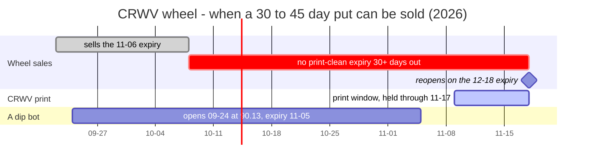
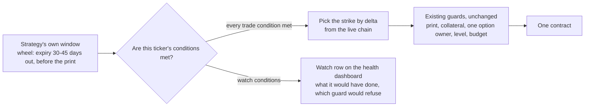

# Buying the dip on NVDA and CRWV — a drop alone has not been an edge

**Kind:** event study (price only) · **Date:** 2026-10-06 · **Symbols:** CRWV, NVDA · **Impact:** medium
**Last assessed:** 2026-10-06

**Question (Eric, 2026-10-06, on the CRWV wheel's window closing after Wednesday 10-07):** _"if a
high quality stock drops and is at a strong discounted price with bullish sentiments.. it could be
an excellent time to enter cash secured puts and/or buy long calls to take advantage of the dip."_
Should the bots get extra conditions that allow those trades?

Reproduce: `node scripts/research/dip-entry-study.mjs CRWV NVDA:2023-01-01 NVDA:2005-01-01 --episodes`
and `node scripts/research/premium-fit.mjs CRWV` (and `NVDA`). Every number below is printed by these
and by the ten-name run in the Builder appendix. Paper only; educational.

## The call

| Ticker · trade | Call | Confidence | Why | Proves it wrong |
|---|---|---|---|---|
| CRWV · put on a dip | Stand aside | medium | Options cheap vs delivered (2nd pct); 10%-below put hit 4 of 9 | First re-run after the filing, on or after **2026-11-13**, clears premium-fit call 1 |
| CRWV · call on a dip | Don't buy | low | After 9 dips: up 4 of 9 (56% normally) | **2027-10-06** watch record: dip calls win more than other days, P < 0.10 |
| CRWV · sold option across a print | Never | medium | Six prints moved −21% to +19% the next session | 3 straight prints from **2026-11-09** move less than the priced straddle |
| NVDA · put on a dip | Stand aside | medium | 70 dips since 2005: 0.20-delta put hit 20% (17% normally) | **2027-10-06** watch record: dip puts end in the money less often, P < 0.10 |
| NVDA · call on a dip | Don't buy | low | Call won 36% after 70 dips (43% normally) | Same test as the CRWV call, **2027-10-06** |
| NVDA · dip with VIX ≥ 25 | Record; size zero | low | Up 17/25 vs 22/45 (p 0.14); split chosen after looking | Under 3 of the first 5 VIX ≥ 25 spells finish up; earliest **2028-10-06** |
| Both · dip put strike | Live-chain delta, never a fixed % | medium | NVDA dips: 10%-below put hit 26% (16% normally); delta put 20% | **2027-10-06**: after dips the delta put rises over normal as much as the 10%-below one |
| Both · bullish news on a dip | Can't judge; record now | none | No dated sentiment history is stored anywhere | Re-test at 10 recorded dip entries, about **2027-11-30** |
| Both · options priced above later moves | Only path to a trade; both fail today | medium | It is crwv-premium-fit call 1's own flip test | First ticker trading it loses over 3 put cycles; earliest about 2027-03 |

**TL;DR.** Record dips; don't trade them. **Signals & conditions:**

- **Buy signal:** no — price dips alone showed no edge on either name.
- Bullish news can't be tested yet: no stored history. Record it now.
- The only path to a real trade is options priced above the moves that follow. Both names fail it today.

## The calls in full

**Summary.** Not on price alone. Across both names and four ways of defining a dip, the stock did
worse in the 30 sessions after a dip than in an ordinary month in 10 of 12 tests, and none did
significantly better. The 12 overlap heavily (NVDA since 2023 sits inside NVDA since 2005, and
CRWV's four dip rules mostly picked the same entry dates), so read it as one consistent direction
from two real samples, not twelve confirmations. A put struck by delta was not reliably safer after
a dip, and a long call won less often. The "bullish sentiment" half of the idea cannot be tested
yet, because no sentiment history is recorded anywhere, so start recording it now. On CRWV, "10%
under its recent high" is not a discount: it was true on 83% of the sessions studied, and on every
session since 2026-06-02. The CRWV wheel is dark from 10-08 to 11-17 because every 30-day expiry
now crosses the 11-09 print. A missing dip rule is not the cause, and no dip can open an option
across a CRWV print: the print guard refuses one, bought or sold. What to build: dip conditions
that only record what they would have done. One condition can earn a real trade: options priced
above the moves that follow. Both names fail it today.

Each row's full wording; the short version is above.

| Ticker · instrument | The call | Confidence | The one-line why | The dated observation that proves it wrong |
|---|---|---|---|---|
| **CRWV · cash-secured put on a dip** | **Stand aside.** No dip trigger; the wheel keeps its own window. | medium | Its options are priced below what CRWV delivers (69.0% implied vs 88.7% median delivered, 2nd percentile). After 9 print-clean dips, a put 10% below finished in the money 4 times (34% normally). | The first re-run on or after **2026-11-13** that also follows CRWV's filing (window 11-09..11-16; a re-run before the filing does not count, because its 30-day implied still carries the print) clears both halves of crwv-premium-fit call 1: implied at or above the 50th percentile of delivered **and** priced assignment odds above history. |
| **CRWV · long call on a dip** | **Don't buy.** | low | After 9 print-clean dips: up 30 sessions later 4 of 9 (56% normally), median −7.4% vs +7.8%. The modeled call won 3 of 9 (44% normally). | Graded **2027-10-06** on the watch rows' record (Method): the at-the-money call, priced at the recorded implied, won more often after drawdowns than on the same names' other sessions, at P(≥) < 0.10. |
| **CRWV · any sold option across a print** | **Never, dip or no dip.** | medium | The six prints moved −2.5, −20.8, −16.3, −18.5, −11.4 and +19.3% on the session after the filing. The 168 windows that held a print are those same six prints, priced without the print premium. | Three consecutive prints, from the one projected **2026-11-09** (the third is due about May 2027), whose two-session move stays inside the at-the-money straddle priced the session before the filing for the first expiry after the print (premium-fit's `em ±`). |
| **NVDA · cash-secured put on a dip** | **Stand aside.** No dip trigger. | medium | 70 print-clean 10% drawdowns since 2005: a 0.20-delta put finished in the money 20% vs 17% normally, so no safer. Its options aren't rich either (28.8% implied, 7th percentile). | Forward test, graded **2027-10-06** on the watch rows' record: the 0.20-delta put from the recorded implied finished in the money less often after drawdowns than on other sessions, at P(≤) < 0.10. A study re-run can't flip it (about 3 NVDA entries a year). |
| **NVDA · long call on a dip** | **Don't buy on a drawdown.** | low | The modeled at-the-money call won 36% after 70 drawdowns since 2005 (43% normally). The 2023+ entries are a subset of those 70 and show the same (38% vs 52%). | The same forward test as the CRWV call row, graded **2027-10-06**. |
| **NVDA · either, during market-wide fear (VIX ≥ 25)** | **Record it; size zero.** | low | Since 2005, 10% drawdowns with VIX ≥ 25 were up 17 of 25 times vs 22 of 45 in calm markets (p 0.14), but the 25 fall in 15 separate VIX ≥ 25 spells. I chose this split after seeing the data. | Forward test, one count per spell (a sell-off moves every name at once): fewer than 3 of the first 5 spells' first print-clean drawdown entries on the tracked names finish up after 30 sessions. At about 1.6 spells a year, the earliest verdict is about **2028-10-06**. |
| **Both · how a dip put picks its strike** | **By delta from the live chain, never a fixed % below the price.** | medium | NVDA since 2005: after 10% drawdowns a put 10% below finished in the money 26% (16% normally); at 0.20 delta it was 20% (17% normally). Delta removes most of the excess, not all of it. | Graded **2027-10-06** on the watch rows' record: after drawdowns, the 0.20-delta put's in-the-money rate rose over its other-session rate by as much as the put 10% below did. |
| **Both · "bullish sentiment" on a dip** | **Can't be judged yet. Start recording today.** | none | No dated sentiment history exists for any single stock. The live score is a rolling 10-article average, and only its current value is saved. | Re-test once ≥10 print-clean drawdown entries (entries, not sessions: CRWV is in a drawdown most days) carry a recorded sentiment reading and have finished their hold. At about 10 a year on these two names (3.6 + 6.8), that is about **2027-11-30**. |
| **Both · options priced above the moves that follow** | **The one condition that may earn a trade.** Both names fail it today. | medium | It is crwv-premium-fit call 1's own flip test. After a dip, delivered volatility fell on CRWV and after NVDA's deeper drops, but only about half the time after NVDA's 10% drawdowns; option prices were never recorded. | Forward test: the first ticker that sells puts on it is net negative after 3 put cycles. Earliest: AMZN after its **2026-10-29** print, about 2027-03 if trade mode has shipped. It cannot fire before a ticker trades it. |

**Readings and next checks:**

- CRWV 10-05: 87.39, 18.9% under its 60-session high (107.73); VIX 15.5; a 30-session hold crosses the 11-09 print.
- NVDA 10-05: 238.90, at its 60-session high, so there is no dip to act on.
- Options vs delivered moves: CRWV 69.0% vs 88.7%; NVDA 28.8% vs 38.7%. Both priced below delivered: not rich.
- Next checks: the CRWV fit re-run once its print is filed (not before 11-13); wheel sales reopen 2026-11-18 on the 12-18 expiry.
- Worth recording, not trading: a drawdown while VIX ≥ 25. CRWV had 16 such sessions; none opened a print-rule episode.

## Why the CRWV wheel is dark from 10-08 to 11-17 (the literal question)



- **It is the print, not a missing threshold.** The wheel sells an expiry 30 to 45 days out that
  ends before CRWV's print window (estimated 11-09 to 11-16, held through 11-17). CRWV lists
  weekly expiries (10-09, 10-16, 10-23, 10-30, **11-06**, 11-13). 10-07 is the last day an expiry
  30+ days out still lands before the window.
- **No dip condition can change this.** The print guard refuses any option opened, sold or bought,
  whose expiry reaches the print window, whatever opened it. A long call on today's CRWV dip would
  also have to expire by 11-06. That is the print row above: CRWV's six prints moved −2.5, −20.8,
  −16.3, −18.5, −11.4 and +19.3% on the session after the filing.
- **The dip already happened inside the window.** A dip bot following the print rule would have
  opened on 2026-09-24 at 90.13 (16% under its high), with a 30-session hold ending about 11-05,
  before the print. The wheel's own window rule was open that day too.
- **The one honest lever before 11-09 is a shorter expiry,** which is a question about the
  wheel's rules, not a dip rule. A 21-day floor would keep selling until 10-16 against the 11-06
  expiry. It is unmeasured. The deciding question: at 15 to 29 days, is the print-clean in-the-money
  rate and the premium per day of collateral better or worse than at 30 to 45 days on CRWV?
  Re-run the study with the hold length as a parameter to answer it.

---

## 1. Method

**Data (no credentials used).**

- **Prices:** Yahoo split- and dividend-adjusted daily closes (`bars()` in
  `scripts/research/market-data.mjs`). The cache was written 2026-10-06 03:16–03:50 UTC and holds
  the 10-05 close. Intraday lows come from the same cached payload, adjusted by adjclose/close,
  and are used only for the worst move against a position.
- **Earnings prints:** SEC EDGAR 8-K Item 2.02 filing dates: CRWV 6 prints (2025-05-14 →
  2026-08-11), NVDA 88 from 2004-10-27. For windows still open, the next prints come from the house
  calendar (`src/domain/earnings-calendar.ts`): CRWV 2026-11-09 (the start of its 11-09..11-16
  estimate window) and NVDA 2026-11-18 (estimate).
- **Benchmark:** QQQ, for the "down more than the market explains" trigger.
- **VIX:** `bars("^VIX")`, 9,259 sessions, 1990-01-02 → 2026-10-05, last 15.52. A **VIX ≥ 25
  spell** is a run of closes at or above 25, with gaps of up to 21 sessions merged. There were 34
  since 2005 (1.57 a year) and 7 since 2023.
- **Option chains, today only:** Cboe delayed quotes via `premium-fit.mjs`, chain as of 2026-10-06
  03:44 UTC (CRWV) and 03:54 UTC (NVDA). There is **no history** of option prices, implied
  volatility or single-stock sentiment reachable without a credential.

**Four dip triggers**, evaluated at the close. Each needs at least 20 sessions of history, and the
60-session window includes the day itself:

| Plain name | Rule |
|---|---|
| 10% drawdown | close at least 10% under the 60-session closing high |
| 20% drawdown | close at least 20% under the 60-session closing high |
| sharp down day | the day's log return at or below −2× the trailing-60 daily standard deviation (the day itself excluded) |
| down more than the market explains | the day's return after removing QQQ's (OLS beta over the trailing 60 sessions) at or below −2 standard deviations |

**Two simulated bots** open at the trigger close and hold 30 sessions (about 42 calendar days,
inside the wheel's 30–45 days). Each looks again only after its hold ends, so episodes never
overlap.

- **Ignores prints:** opens on every trigger.
- **Follows the print rule:** also requires that no 8-K filing date falls between entry and expiry
  inclusive. A filing on the entry or expiry day counts, which is conservative. This is the house
  rule, and it produces the headline numbers.

**Normal (the base rate):** every session in the same era with a finished 30-session window
(overlapping), split into print-clean windows and windows that held through a print. "Normally" in
this doc means the print-clean base. Overlapping windows are not independent: n windows hold about
n/30 independent ones.

**Outcomes per episode:**

- Returns at 5, 20 and 30 sessions, and whether the session-30 close sits above the entry close.
- The worst intraday low over the hold, against the entry close.
- **A put 10% below the price** (strike = 0.90 × entry close): in the money if the session-30 close
  is under the strike, ignoring early assignment. Also whether an intraday low touched the strike.
- **A 0.20-delta put, modeled:** strike from Black-Scholes at σ = trailing 21-session realized
  volatility at entry (dip day included), r = 4%, T = 30/252. P&L = modeled credit − intrinsic at
  expiry, per dollar of collateral.
- **An at-the-money call, modeled** at the same σ, paid off at the session-30 close. It "won" if
  the payoff beat the premium.
- **Realized volatility:** the **dip-time level** is the 21 sessions before the dip day (the dip
  day excluded, so the drop itself cannot inflate it); "after" is the 21 sessions after; "a normal
  window's level" is the median "after" over the print-clean base.
- **Entry rate:** print-rule entries per year, over the span whose 30-session windows have
  finished.

**Tests.** "P(≥)" is the one-sided binomial chance of seeing at least that count if the true rate
were normal, and "P(≤)" of at most that count (`binomTail`, `scripts/research/earnings-controls.mjs`).
A **t** is a one-sample t statistic of the episodes' 30-session returns against the print-clean
base mean. The VIX split uses a two-sided Fisher exact test. The script prints all of them on each
trigger's `tests`, `realized vol` and `VIX split` lines, and counts them: the default run prints
**75**, so about 4 would land under 0.05 by chance.

**The watch rows' record (what the forward falsifiers read).** A re-run of this study cannot flip
its NVDA calls: it adds about 3 NVDA entries a year to 70. The dated forward tests therefore read
the watch rows the design below builds (slices 1–2). From the day they start recording, each
tracked name logs every print-clean 10%-drawdown entry (one per 30-session hold, like the study's
bot) with that day's 30-day implied volatility. The comparison is the same names' other sessions
in the same months, priced from the same recorded implied. A count takes **at most two entries per
calendar month** across the names, because one sell-off moves them together. Since 2023 the ten
tracked names produced 117 such entries in 42 months, 74 after that cap: about 20 a year, so 10 or
more is reachable well inside a year. The tests are graded on **2027-10-06**, at P < 0.10 where a
row names a P. If the
watch rows have not started recording by 2026-12-31, the grading date slides by the same delay.

## 2. The numbers

### CRWV — 2025-04-28 → 2026-10-05 (362 sessions, 6 prints)

**On CRWV a 10% drawdown is the normal state.** It held on **302 of 362** sessions studied (83%),
and on every session since 2026-06-02. A 20% drawdown held on 223 (62%). For NVDA since 2023 the
same figures are 26% and 6%. A "strong discount" on CRWV would need a far deeper threshold, or a
different definition entirely.

| Set | n | Up after 30 sessions | 30-session return, mean / median | Put 10% below: in the money (touched) | 0.20-delta put, modeled: in the money | Worst move, median / worst | Modeled call won | Realized vol, dip-time level → after (median) |
|---|---|---|---|---|---|---|---|---|
| Normal: print-clean windows | 164 overlapping (≈5–6 independent) | 56% | +10.3% / +7.8% | 34% (71%) | 14% (strike ≈21% below) | −16.3% / −48.7% | 44% | 104% → 86% |
| Windows held through a print | 168 overlapping (six prints) | 35% | +7.5% / −9.2% | 46% (83%) | 33% | −26.0% / −54.0% | 23% | 88% → 100% |
| 10% drawdown, follows print rule | 9 | 4 of 9 (P(≥) 0.85) | +3.2% / −7.4% (t = −1.01) | 4 of 9 (8 of 9) | 0 of 9 (strikes 18–25% below) | −20.3% / −42.7% | 3 of 9 | 95% → 79%, lower in 7 of 9 |
| 20% drawdown, follows print rule | 8 | 3 of 8 (P(≥) 0.92) | +2.4% / −7.3% | 2 of 8 (8 of 8) | 0 of 8 | −16.9% / −38.7% | 2 of 8 | 92% → 78%, lower in 6 of 8 |
| 10% drawdown, ignores prints | 11 (6 across a print) | 6 of 11 | +23.3% / +3.1% | 4 of 11 | 3 of 11 | −17.2% / −51.2% | 4 of 11 | — |

**The nine 10%-drawdown entries that follow the print rule:**

| Entry | Close | Under its high | 30 sessions later | Put 10% below | Note |
|---|---|---|---|---|---|
| 2025-05-29 | 105.55 | −15% | +25% | out of the money | |
| 2025-08-13 | 117.76 | −36% | +8% | out of the money | session after a print |
| 2025-09-25 | 126.66 | −23% | −16% | in the money by 6% | |
| 2025-11-11 | 88.39 | −38% | −11% | in the money by 1% | session after a print |
| 2025-12-24 | 78.87 | −45% | +23% | out of the money | |
| 2026-02-27 | 79.56 | −27% | +39% | out of the money | session after a print |
| 2026-05-08 | 114.15 | −17% | −7% | out of the money | session after a print |
| 2026-06-23 | 105.72 | −23% | −15% | in the money by 6% | |
| 2026-08-12 | 107.73 | −14% | −16% | in the money by 7% | session after a print, but a **+19.3% up day**, still 14% under its high |

Hand-check of one row: 2025-11-11 closed at 88.39 against a 60-session high of 143.08 (−38.2%).
Thirty sessions later (2025-12-24) it closed at 78.87, which is −10.8% and under the 79.55 strike.

- **Five of the nine entries fell on the session right after a print.** On CRWV the "sharp down
  day" triggers say the same thing more bluntly. All 4 print-rule sharp-down-day entries, and 4 of
  5 against QQQ, were the session after a print. Each trigger fired on only 8–9 sessions in the
  whole history.
- **CRWV's four triggers are mostly one set of entries.** The 20% drawdown picked the same session
  as the 10% drawdown 5 times out of 8 and was within 5 sessions 3 more times. All 4 sharp-down-day
  entries and 4 of the 5 QQQ-adjusted ones are 10%-drawdown entries.
- **The modeled 0.20-delta put finished in the money 0 of 9 (14% normally).** That is not
  significant (zero happens by chance 26% of the time at 14%), and the model flatters it. It
  priced options at trailing 21-session realized volatility, which ran 84–142% at these nine
  entries (median 107%), so its 0.20-delta strikes sat 18–25% below the price. The real chain
  hands you a much closer strike: on 10-05 the 0.20-delta put for 11-06 was the **$75** strike,
  about 14.6% below, because implied volatility (69%) sits under what CRWV delivers. The put 10%
  below today is about 0.28 delta at 69% (today's realized, and the implied) and 0.30 at 86% (a
  normal window's realized), close to the wheel's 0.30 ceiling. It finished in the money **4 of
  9**, worse than normal.
- **The print rule binds hard on CRWV.** One example of what it prevents: the print-ignoring bot's
  2025-10-31 entry fell 46% in 30 sessions. Its put 10% below finished 40% under the strike, and the
  0.20-delta put finished 36% under its strike.

### NVDA — since 2023 (942 sessions, 15 prints)

These 13 drawdown entries are the last 13 of the 70 in the since-2005 table below, not a second
sample.

| Set | n | Up after 30 sessions | 30-session return, mean / median | Put 10% below in the money | 0.20-delta put, modeled | Worst move, median / worst | Modeled call won |
|---|---|---|---|---|---|---|---|
| Normal: print-clean windows | 450 overlapping | 70% | +8.3% / +7.6% | 5% | 3% | −6.1% / −32.8% | 52% |
| 10% drawdown | 13 | 9 of 13 | +7.0% / +3.5% (t = −0.25) | 2 of 13 (P(≥) 0.15) | 0 of 13 | −10.3% / −27.9% | 5 of 13 |
| 20% drawdown | 3 | 2 of 3 | +26.0% | 0 of 3 | 0 of 3 | −6.5% / −24.1% | 2 of 3 |
| Sharp down day | 8 | 4 of 8 | −0.3% / −1.5% (t = −2.16) | 2 of 8 (P(≥) 0.064) | 0 of 8 | −12.4% / −27.9% | 2 of 8 |
| Down more than QQQ explains | 7 | 5 of 7 | +5.1% / +4.0% | 0 of 7 | 0 of 7 | −7.6% / −14.2% | 3 of 7 |

- 10%-drawdown entries: 2023-01-03, 2023-09-15, 2024-04-09, 2024-06-24, 2024-08-29, 2024-12-16,
  2025-02-27, 2025-04-10, 2025-11-20, 2026-01-08, 2026-03-20, 2026-05-29, 2026-07-14. The two puts
  10% below that finished in the money were 2024-06-24 (by 2%) and 2025-02-27 (by 1%). Realized
  volatility after the dip was above a normal window's median (37%) in 10 of 13.
- 20%-drawdown entries: 2023-01-03 (+59%), 2024-09-03 (+22%), 2025-03-03 (−3%).
- The sharp-down-day t of −2.16 is one of the 75 comparisons the default run prints. About 4 like
  it are expected by chance.

### NVDA — since 2005 (5,473 sessions, 87 prints)

| Set | n | Up after 30 sessions | 30-session mean | Put 10% below in the money | 0.20-delta put, modeled | Worst move, median / worst | Modeled call won | Realized vol after the dip |
|---|---|---|---|---|---|---|---|---|
| Normal: print-clean windows | 2,758 overlapping | 61% | +4.0% | 16% | 17% | −6.9% / −56.9% | 43% | median 37% |
| 10% drawdown | 70 | 39 of 70 = 56% (P(≥) 0.85) | +2.4% (t = −0.74) | 18 of 70 = 26% (P(≥) 0.032) | 14 of 70 = 20% (P(≥) 0.27) | −11.4% / −52.0% | 36% | above normal's median in 48 of 70; below its dip-time level in 39 of 70 |
| 20% drawdown | 32 | 16 of 32 = 50% (P(≥) 0.93) | +2.4% (t = −0.43) | 12 of 32 = 38% (P(≥) 0.003) | 9 of 32 = 28% (P(≥) 0.073) | −15.9% / −46.1% | 38% | above normal's median in 28 of 32; below its dip-time level in 21 of 32 |
| Sharp down day | 46 | 31 of 46 = 67% (P(≥) 0.24) | +4.2% (t = 0.05) | 11 of 46 = 24% (P(≥) 0.12) | 17% | −6.6% / −38.5% | 50% | — |
| Down more than QQQ explains | 55 | 34 of 55 = 62% (P(≥) 0.51) | +2.5% (t = −0.70) | 12 of 55 = 22% (P(≥) 0.18) | 22% | −8.1% / −52.0% | 44% | — |

NVDA's triggers overlap too: 26 of the 32 20%-drawdown entries fall on or within 5 sessions of a
10%-drawdown entry, as do 29 of 46 sharp-down-day entries.

- On NVDA, windows held through a print were **not** worse than clean ones. Since 2005, among 10%
  drawdowns that ignored prints, the ones held through a print were up 62% of the time (put 10%
  below: 17% in the money), against 56% (20%) for the clean ones. Since 2023 the same split is 71%
  (0%) against 73% (9%). The extra damage from holding through a print is specific to CRWV in this
  data.

**How the 12 return tests come out:** 3 eras × 4 triggers, print rule followed. The 30-session mean
after a dip sat below normal in **10 of 12**. The two above were NVDA-since-2023's 20% drawdown
(n = 3) and NVDA-since-2005's sharp down day (+4.2% vs +4.0%, t = 0.05). None was significantly
above. The 12 are not independent: NVDA since 2023 sits inside NVDA since 2005, and each name's
triggers mostly share entries. They amount to two samples, NVDA since 2005 and CRWV, pointing the
same way. Neither is significant on its own (t = −0.74 and −1.01 for the 10% drawdown).

**How the modeled call comes out in the 8 tests with at least 8 episodes:** it won less often than
normal in 6. It lost to normal in **all 5 drawdown tests** (CRWV 33% and 25% vs 44%; NVDA since
2023 38% vs 52%; NVDA since 2005 36% and 38% vs 43%) and in NVDA-since-2023's sharp down day (25%
vs 52%). The two exceptions are NVDA-since-2005's sharp-down-day triggers: 50% vs 43% (n = 46) and
44% vs 43% (n = 55). Neither is significant. The 5 drawdown tests share the same overlap (CRWV's two
mostly the same entries, NVDA since 2023 inside 2005), so the "don't buy calls" rows above are
scoped to drawdowns and graded low.

**Fixed-percent strike vs delta strike (NVDA since 2005).** A put 10% below finished in the money
more often after a dip (26% after 10% drawdowns vs 16%; 38% after 20% drawdowns, mostly the same
dips), because volatility is higher after a dip and a fixed 10% sits closer in volatility terms.
Scaled to volatility (0.20 delta), most of that excess goes away after 10% drawdowns (20% vs 17%,
P(≥) 0.27). After 20% drawdowns some remains (28% vs 17%, P(≥) 0.073). The wheel already picks by
delta from the live chain. This only constrains a new rule.

### Market-wide fear vs a calm market (chosen after seeing the data)

Print rule followed; VIX close on the entry date. Every row is on the script's `VIX split` line.

| Set | VIX ≥ 25 | VIX < 25 | Fisher p (two-sided) |
|---|---|---|---|
| NVDA since 2005, 10% drawdown: up after 30 sessions | 17 of 25 (68%), in 15 separate VIX ≥ 25 spells | 22 of 45 (49%) | 0.14 |
| — 0.20-delta put in the money | 2 of 25 | 12 of 45 | 0.071 |
| — put 10% below in the money | 4 of 25 | 14 of 45 | 0.25 |
| — 30-session mean | +8.2% | −0.8% | — |
| — without 2008 | 16 of 22 up | 22 of 43 up | — |
| NVDA since 2005, 20% drawdown: up / 0.20-delta put in the money | 9 of 15 / 3 of 15 (10 spells) | 7 of 17 / 6 of 17 | 0.48 / 0.44 |
| NVDA since 2023, 10% drawdown: up | 3 of 3 (2025-04-10, 2025-11-20, 2026-03-20) | 6 of 10 | 0.50 |
| CRWV, any trigger, print rule followed | 0 episodes | all of them | — |

The direction is plausible: a dip the whole market shares is more often a price-of-fear discount
than a dip that is about the company. It is still a lead, not a finding. The split was picked after
looking, no single test clears 0.05, the 25 NVDA entries are only 15 independent sell-offs, and no
CRWV print-rule episode has ever opened with VIX at or above 25. CRWV did sit 10%+ under its high
with VIX ≥ 25 on 16 sessions (2025-04-28, 2025-11-20 and 14 from 2026-03-06 to 2026-04-07), but the
bot was already holding on 15 of them (the 11-11 and 02-27 entries), and on 04-28 a 30-session
window crossed the 05-14 print. The print-ignoring bot did open on two (2025-04-28, +269% across
that print; 2026-03-13, +38%): anecdotes, not a sample. So it is a forward test, size zero, counted
once per spell.

### What "premium got rich after a drop" would need

A seller earns when options are priced above the moves that follow. Price data can show half of
that, the moves:

- **After a dip, realized volatility usually fell from its dip-time level on CRWV** (10% drawdowns
  7 of 9) **and after NVDA's 20% drawdowns** (21 of 32), **but not reliably after NVDA's 10%
  drawdowns** (39 of 70 since 2005; 5 of 13 since 2023).
- **On NVDA it stayed above a normal window's level** (37% median: 28 of 32 after 20% drawdowns, 48
  of 70 after 10% drawdowns). **On CRWV it did not:** above the normal 86% median in only 2 of 9
  and 2 of 8.
- **The other half, whether option prices actually stayed high after a dip, needs implied-volatility
  history, which isn't reachable.** Today's single snapshot says CRWV's options are cheap, not
  rich: 69.0% implied against 88.7% median delivered, the 2nd percentile of the last year
  (2026-10-05 chain). NVDA's are 28.8% against 38.7%, the 7th percentile.

### Today's readings (10-05 close)

| | CRWV | NVDA |
|---|---|---|
| Close / 60-session high | 87.39 / 107.73 (−18.9%) | 238.90 / 238.90 (0%) |
| In a 10% drawdown? | yes, every session since 2026-06-02; 20%+ as recently as 09-29 | no |
| Day's move in standard deviations | −0.41 | +0.86 |
| Trailing 21-session realized volatility | 69% | 25% |
| 30-day implied (Cboe, delayed) | 69.0%, 2nd percentile of delivered | 28.8%, 7th percentile |
| 0.20-delta put, nearest print-clean expiry | $75 at 11-06, bid $2.08: $7,500 set aside for about $208 | (no dip, not needed) |
| A 30-session hold from today crosses a print? | yes (11-09 window) | no (11-18 estimate) |
| VIX | 15.52 | 15.52 |
| Open episode, not counted | print-rule bot since 2026-09-24 at 90.13, ends ~11-05 | none |

## 3. Caveats — what this cannot say

1. **Thin, overlapping samples, so confidence is capped.** CRWV has 8–9 episodes per trigger, all
   inside one 18-month life and mostly one decline, and its four triggers mostly picked the same
   entries. NVDA since 2023 is the last 13 of NVDA since 2005's 70. So the study holds two real
   samples, NVDA since 2005 and CRWV, not twelve. CRWV's "normal" is 164 overlapping windows, about
   5–6 independent ones. That is why every CRWV dip finding is graded low. The CRWV put row's medium
   rests on the separate options-vs-delivered measurement. NVDA since 2005, with 32–70 episodes, is
   the one sample that lifts the "a dip alone is no edge" direction to medium, and only for NVDA.
2. **Every option price here is modeled.** There is no option-price or implied-volatility history,
   so premiums use Black-Scholes at trailing realized volatility. Real implied volatility differs:
   CRWV's runs below its realized, so the model's 0.20-delta strikes sit deeper than a real one
   would. The call rows are graded low for this reason.
3. **The across-a-print comparison is six prints, priced without the print.** Its 168 windows
   overlap onto CRWV's six prints, and the model prices them at trailing realized volatility, so it
   leaves out the extra premium a real chain charges for the event (today's 11-13 expiry: 76.2%
   implied against 69.6% for 11-06). The six next-session moves carry the call, which is why it is
   medium here. The print guard enforces it whatever the grade.
4. **"Bullish sentiment" is untested.** No dated sentiment history for a single stock is stored
   anywhere a session can read. The bots' production volume holds a per-cycle sentiment tape, and
   an Alpaca key gives news history; both sit behind credentials Eric holds, and neither was used.
5. **Many comparisons.** The default run prints 75 P values and t statistics, so three or four
   under 0.05 are expected by chance. The NVDA-since-2023 sharp-down-day result (t = −2.16) is
   probably one of them.
6. **The VIX split was chosen after seeing the data.** It is registered as a forward test only,
   counted once per VIX ≥ 25 spell.
7. **Assignment is simplified.** "In the money" means the session-30 close is under the strike.
   Early assignment is ignored, and intraday touches are reported separately.
8. **Print dates are filing dates.** EDGAR gives no time of day, so a filing on the entry or expiry
   day counts as crossing. CRWV's next print is an estimate (11-09..11-16).
9. **Hindsight on "high quality".** Both names were picked because they are AI winners today. NVDA
   since 2005 includes years when it was not a mega-cap.
10. **One hold length.** 30 sessions only. A shorter expiry, the only lever before 11-09, is
    unmeasured.
11. **The forward tests depend on watch rows that do not exist yet.** Their dates assume recording
    starts by 2026-12-31; a later start moves them by the same amount.
12. **A side observation on the research tool.** `premium-fit.mjs` projects NVDA's next print from
    the median gap (11-25), while the house calendar estimates 11-18 (window 11-17..11-25). Its
    ladder therefore treats the 11-20 expiry as print-clean. The trading guards read the house
    calendar, so no order can follow from this, but the tool should read the same calendar.

## 4. Design — where dip conditions would live

### Interrogating the ask (three lines)

- **Steelman.** The outcome Eric wants is to enter quality names when they are cheap, at a measured
  risk. His proposed mechanism is extra thresholds that _allow_ trades, including inside today's
  closed CRWV window.
- **Strongest objection.** The closed window is the print rule (crwv-premium-fit call 3), enforced
  by the print guard on every option open. A threshold that "allows" a trade there would be
  widening a guard. And on price alone, a dip carried no edge in this study.
- **What settles it, and the amended shape.** A forward watch record per condition and per ticker.
  Conditions only narrow a strategy's entries, never widen a guard. Dip conditions start in watch
  mode. A ticker earns "trade" for a condition only through its evidence: house research, or the
  owner's labelled, dated conviction.

### The evaluation order



**Rules of the grammar:**

- Each ticker's entry for a condition carries: the condition and its settings, **watch or trade**,
  its basis (a research doc and call number, or the owner's conviction with a reason and a check
  date), its falsifier and its check date.
- The strategy's own window always applies. Trade conditions combine with it by AND, and never by OR.
  A condition that would open a trade **outside** the window is a new strategy and needs its own
  evidence.
- Watch conditions never block anything; they only record.
- A missing input reads "unknown: which input". Unknown never fires a trade.
- Conditions are evaluated in the session's last half hour, with the live price as the provisional
  close. That is the same window the daily implied-volatility sampler already uses, and it matches
  the study's "open at the dip close".

### The conditions, and the status the study supports

| Condition, in plain words | What it reads | Tested here as | Status |
|---|---|---|---|
| Drawdown: at least X% under its recent high | daily closes | 10% and 20% under the 60-session high | **watch** |
| Sharp down day: the day's move at or below −2× its usual | daily closes | −2σ of the trailing 60 sessions | **watch** (on CRWV it means "the day after a print") |
| Down more than the market explains | daily closes + QQQ | −2σ residual, 60-session beta | **watch** |
| Turned up after a drawdown: a daily version of the Sauron persona's rule (buy on panic once momentum stops falling) | daily closes | not tested; testable now on price alone | **untested** — add it to the study first |
| News against price: bullish news while the price falls (Eric's "bullish sentiment") | one dated sentiment reading per session | not testable: no history | **watch, once recording starts** |
| Options priced above the moves that follow | 30-day implied + a year of delivered moves | crwv-premium-fit call 1's falsifier | **the only path to trade** |
| Implied volatility high for this name (percentile) | a year of the daily sampler's readings | absent: needs 365 days of samples (CRWV ~2027-09) | **absent** |
| Market-wide fear: VIX ≥ 25 | one VIX read a day | the after-the-fact split above | **watch, size zero** |
| _Never a condition:_ anything that names the print | — | — | the print is a guard; no condition relaxes it |

### Which instrument each situation favors

- **Options priced above the moves that follow:** sell a cash-secured put at a target delta from
  the live chain. This is the wheel.
- **A price dip with options not rich:** nothing. Stand aside and record.
- **Buying into a dip:** not yet, as a bare call or a spread. #4642's "about 37% cheaper" was
  measured in NVDA's pre-earnings window, where the sold upper call sheds print premium. Nobody has
  measured it after a dip, because option prices after a dip were never recorded. A cheaper ticket
  is not an edge: a spread gives up everything past its upper strike, which is where CRWV's three
  best dip entries paid (+25%, +23%, +39% in 30 sessions). Let the watch rows record both the
  at-the-money call ask and a spread's net debit, and let that record pick the shape.
- **Market-wide fear:** a 0.20-delta cash-secured put would be the shape. Record it only.
- **Any situation across a print:** never a sold option (CRWV's 0.20-delta put, modeled, in the
  money 33% across its six prints vs 14% clean).
- **Strike choice:** always by delta, never a fixed % below the price.

### How the existing guards bind (all unchanged; conditions sit in front of them)

- **Print.** The strategy's own sale window, plus the print guard, which runs on every option open,
  bought or sold: it refuses an expiry that reaches the print window, any open inside the window,
  and any open when the print date is unknown.
- **Collateral.** The put must be fully secured with cash not already reserved. For CRWV today that
  means the $75 put: $7,500 set aside for about $208 at the bid.
- **One option strategy per underlying.** This is the decisive objection to shape B below.
- **Options level.** Level 1 for a cash-secured put, level 3 for a spread.
- **Budget.** The subscription's own budget.
- **Exits** are never gated by any condition, the same posture the guards already take.
- **Watch rows place nothing,** but they record which guard _would_ have refused. For example: "met;
  the print guard would refuse: a 30-session hold crosses 11-09". That line shows Eric that the
  print rule, not a missing threshold, is what binds.

### Sizing

- One contract per ticker, unchanged. A condition never changes size.
- Low confidence means stand aside, so a low-confidence condition is watch, never a small bet.
- Conditions are AND-gates, so they can only make a strategy trade less often.
- Scaling past one contract reopens at the wheel's own check on 2027-01-29.

### How it shows

On the ticker's row of the strategy card, at phone width. Every state carries a glyph and a word,
never colour alone:

```
CRWV · the wheel · ◆ your conviction
On · 1 contract · about $7,500–8,000 set aside
Sells when
 ✓ open      between prints, 30–45 days out (last day 10-07)
Watching: records, never trades
 ● met       10% under its 60-day high (18.9%)
 ○ not met   options priced above the moves that follow
             (implied 69% · needs ≥ 89%)
 ○ not met   market-wide fear (VIX 15.5 · needs 25)
 ⛔ blocked  a 30-session hold now crosses the 11-09 print
```

- **On Activity, only for a real fill.** The fill's reason names the condition that opened it and
  its readings. "Proves it wrong" carries both the ticker's falsifier and the condition's dated
  falsifier. The order's selection record gains the condition and its readings, so a retrospective
  can grade each condition. That is a wire change, so it ships app-first.
- **Watch rows go to the health dashboard (Heartbeat), never to Activity.** This is the condition
  scanner's precedent (#3651; Eric, 2026-09-30: "keeps the information contained to the health
  dashboard"). No account's numbers move.

### What the bots lack today

1. **A daily feature row per ticker:** the 60-session high, the trailing standard deviation, 21-day
   realized volatility and the QQQ residual. The bots already read about 40 sessions of Alpaca daily
   closes for the condition scanner. That read stretches to about 90 calendar days (about 400 for
   the rich-options check), and QQQ joins the read list. The decision context has no daily bars
   today.
2. **30-day implied volatility per underlying, recorded daily.** Option quotes carry bid, ask and
   delta, but no implied volatility. The daily sampler runs in the dashboard process, not the bots
   process. The simplest fix is one free Cboe delayed read per ticker per day, the source
   premium-fit already uses. Every forward test above prices against this record.
3. **VIX.** There is no feed in the bots. Cboe's free delayed quote covers it (the design pass read
   15.52 for the 10-05 close, matching Yahoo's close). That is one free read a day.
4. **A sentiment history.** The live score is a rolling 10-article average, and only the current
   window is saved. Record one dated reading per ticker per session, like the daily
   implied-volatility sampler. It cannot be backfilled, so every unrecorded day is lost.

### Three shapes

| Shape | What it is | Size | Red-team |
|---|---|---|---|
| **A · a dip setting on the wheel only** | one per-ticker "sell the put only when …" setting on the existing wheel | about 1 PR | It can only narrow the wheel, so it never "allows" a trade. It has nowhere to keep watch rows, and it covers neither calls nor spreads. |
| **B · a separate dip strategy per ticker** | its own instrument, e.g. a call debit spread on a 10% drawdown | the most new UI: a second subscription and budget | Refused while the wheel holds CRWV, by the one-option-strategy-per-underlying rule. Its card would show no evidence, because the study gives it none. |
| **C · one shared list of entry conditions, set per ticker, watch first** (recommended, medium) | every option strategy reads it; each ticker's evidence sets watch or trade per condition | 4 slices | A lot of machinery for a study that found no tradeable dip edge. The answer: the first slices place no trades, and they are what make every forward falsifier above gradable. It also absorbs two one-off pieces of code: the observe-only detector for a falling price with bullish news, and the premium-fit falsifier. |

### Design calls

| # | The call | Confidence | Why | Proves it wrong |
|---|---|---|---|---|
| 1 | Conditions are per-ticker settings that only narrow (AND with the window, ahead of the guards). No condition relaxes a guard. | high | #4469's rule that a ticker may narrow its strategy's bounds and never widen them; the guards' posture | Policy, no tape test. Any need to widen is a new strategy with its own evidence, checked at each new strategy from 2026-10-06. |
| 2 | Shape C | medium | B is refused by the ownership rule; A cannot hold watch rows or a spread | By 2027-06-30 only the wheel uses any condition, so collapse to A. |
| 3 | Price-dip conditions are watch-only on every ticker | medium on NVDA; low on CRWV and the other eight, where watch is the default without evidence | The research call sheet above: two samples, both pointing the same way | The NVDA put row's or the call rows' forward tests firing when graded on **2027-10-06** |
| 4 | "Options priced above the moves that follow" is the one condition with a path to trade | medium | It is crwv-premium-fit call 1's own flip test | Forward test: the first ticker that trades on it is net negative after 3 put cycles. Earliest: AMZN after its **2026-10-29** print, about 2027-03 if trade mode has shipped. |
| 5 | Don't buy calls or spreads on a drawdown | low (premium modeled) | Below normal in all 5 drawdown tests with n ≥ 8, which are two samples | The call rows' forward test, graded **2027-10-06** |
| 6 | Watch widely, trade narrowly: list watch conditions on all 10 tracked underlyings | medium | NVDA and CRWV alone average about 10 print-clean 10%-drawdown entries a year (3.6 + 6.8); all ten tracked names gave 117 since 2023, 74 counted at two a month (about 20 a year) | Fewer than 10 counted watch entries across the tracked set by **2027-10-06** |

### Slicing sketch

1. **A daily feature row in the bots** (bars, QQQ, 30-day implied, VIX), plus a dated sentiment
   reading per ticker. Places no trades. The forward tests start counting the day it records.
2. **The conditions as pure code, plus watch rows on the health dashboard.** Reuse the condition
   scanner's simulated-fill rule: sell at the bid, buy at the ask. Places no trades. It can ship
   before #4469's per-ticker evidence table, because watch rows key on ticker × condition.
3. **The card lines and the condition on the order's selection record,** app-first.
4. **Trade mode.** It opens only when a ticker's evidence earns it. The first candidate is the
   AMZN wheel on the rich-options condition, after AMZN's 10-29 print.

Don't touch the CRWV wheel subscription before 2026-10-08.

## 5. Vocabulary

- **Drawdown:** how far a stock sits below its recent high.
- **Print-clean:** the option's expiry falls before the earnings window.
- **Delta (for a sold put):** roughly the market's odds the put finishes in the money. A 0.20-delta
  put is priced as about a 1-in-5 chance.
- **Rich premium vs high premium** (from #4642): options priced above the moves that follow, vs
  simply expensive options. A seller earns only the first.
- **Watch vs trade:** a condition that records what it would have done, vs one that places orders.
- **VIX ≥ 25 spell:** one stretch of market-wide fear, counted once however many names dip in it.

## Stance

**Stand aside on dip entries for both names: record, don't trade.** The CRWV wheel stays as it is;
its next sale window opens 2026-11-18. Re-run the CRWV fit test once its print is filed (no earlier
than **2026-11-13**). Start the watch rows and a dated sentiment reading per ticker now, because
the forward tests and Eric's sentiment half can only be graded from the day recording begins. Grade
the watch rows' record on **2027-10-06**. A re-run of this study adds about 3 NVDA and 7 CRWV
entries a year, too few to flip a call; re-run it on 2027-04-06 only to refresh the numbers.

### Kill switches

- **The NVDA stand-aside is wrong** if, on the watch rows' record graded 2027-10-06, the 0.20-delta
  put from the recorded implied finished in the money less often after drawdowns than on the same
  names' other sessions, at P(≤) < 0.10.
- **The call rows are wrong** if, on the same record, the at-the-money call won more often after
  drawdowns than on other sessions, at P(≥) < 0.10.
- **The CRWV put stand-aside is wrong** if the first re-run after CRWV's filing (no earlier than
  2026-11-13) clears both halves of crwv-premium-fit call 1.
- **The across-a-print row is wrong** if three consecutive CRWV prints, from the one projected
  2026-11-09, move less over two sessions than the straddle priced the session before each filing.
  That needs a premium-fit run the session before each filing, kept with its output.
- **The market-wide-fear lead is dead** if fewer than 3 of the first 5 separate VIX ≥ 25 spells
  finish up after 30 sessions (earliest verdict about 2028-10-06).

## Builder appendix

**Commands (all exit 0, run 2026-10-06):**

- `node scripts/research/dip-entry-study.mjs CRWV NVDA:2023-01-01 NVDA:2005-01-01 --episodes --json=<scratch>/all.json`
  prints every figure in this doc: the per-trigger `tests`, `realized vol`, `print-blind split`,
  entry-rate, `VIX split` and VIX ≥ 25 session lines, the entry-overlap lines, today's readings, and
  the count of comparisons.
- `node scripts/research/dip-entry-study.mjs AAPL:2023-01-01 MSFT:2023-01-01 NVDA:2023-01-01 GOOGL:2023-01-01 AMZN:2023-01-01 META:2023-01-01 AVGO:2023-01-01 TSLA:2023-01-01 CRWV MRVL:2023-01-01`
  gives the ten tracked names' entry rates and the pooled line (117 entries, 74 counted at two a
  month, 20.4 a year).
- `node scripts/research/premium-fit.mjs CRWV` and `… NVDA` (cached chain, 2026-10-06)
- `scripts/research/dip-entry-study.mjs` is new and untracked.

**Script labels → plain names:** `dd10` = 10% drawdown · `dd20` = 20% drawdown · `down2s` = sharp
down day · `resid2s` = down more than QQQ explains · "print-blind" = ignores prints · "print-aware" =
follows the print rule · "ex-dip" = the dip-time level, dip day excluded.

**Code the design touches:**

| What | Where |
|---|---|
| Wheel's 30-day floor and window | `src/playbooks/wheel.ts` — `MIN_DTE = 30` (l.65), `saleWindow` (l.150), `WHEEL_DELTAS` (l.112) |
| CRWV print window | `src/domain/earnings-calendar.ts` l.115–119 (11-09..11-16, estimate 11-10) |
| Print guard | `src/engine/option-guards.ts` `printProblem` (l.170), called by `clampOpen` (l.216) on every open, bought or sold: `option-spans-print`, `option-print-unknown` |
| Collateral guard | same file, `coverProblem` (l.190) |
| One contract | same file, `MAX_OPTION_OPEN_UNITS = 1` (l.52); budget refusal l.246 |
| One option strategy per underlying | `src/playbooks/option-ownership.ts` `claimOptionUnderlyings` (l.17) |
| Strike by delta | `src/options/contract-picker.ts` `pickByDelta` (l.148) |
| Order selection record | `src/domain/types.ts` `OptionSelection` (l.181); option quote fields l.45–60 (no implied volatility) |
| Mixed-signals rule (observe-only) | `src/playbooks/mixed-signals.ts` |
| Sauron's panic rule | `src/personas/sauron.ts` l.26–27 (sentiment ±0.70) |
| Momentum window (20 ticks, not daily) | `src/autonomous/momentum-tracker.ts` l.13 |
| Sentiment window (10 articles) | `src/news/sentiment-tracker.ts` l.15 |
| Daily implied-volatility sampler timing | `src/research/iv-sampler.ts` `SAMPLE_LEAD_MS` (l.28) |
| IV percentile needs a year | `src/research/iv-rank.ts` `IV_WINDOW_DAYS = 365` (l.29) |
| Bots' tracked list (no QQQ) | `src/scripts/run-autonomous.ts` `UNIVERSE` (l.85) |
| Condition scanner's daily bars | `src/scripts/autonomous-cond-scout.ts` `LOOKBACK_DAYS = 60` (l.29) |
