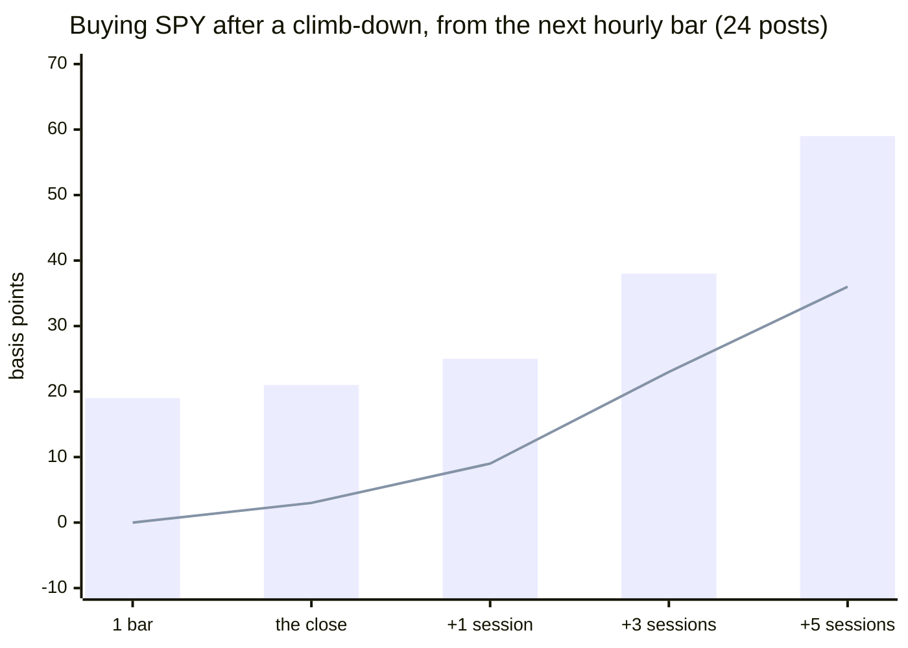

# TACO backtest, the original trade — what SPY and QQQ do after a tariff threat and after a climb-down

**Question (#4820, slice 1b):** _"TACO"_ (Trump Always Chickens Out, Robert Armstrong, FT, 2025-05-02)
names a different trade from slice 1's company posts: a tariff threat sells the index off, he backs
down, it rebounds over days. Company moves were over by the next hourly bar. A move that takes days
might still be there for a reader who sees the post late.

**Verdict: don't trade it.** After 53 threat posts and 24 climb-down posts since 2024-11, nothing a
minutes-late reader could do beats the market's own drift. **Shorting the index after a threat
loses** (−11 bp at five sessions; the index was up 56% of the time by then). **Buying after a
climb-down looks better and isn't**: +59 bp at five sessions on SPY, but the market itself rose
36 bp over the same five sessions, and the spread between climb-downs is so wide (three in ten lost
money) that the excess is t 0.6. 1 of 120 cells printed here passes the plan's bar, and it does not survive the
correction for 120 looks. The one episode that did pay, the 2025-04-09 pause, had already moved the
index +5% by the next hourly bar.

Reproduce: `node scripts/research/taco-index.mjs` (add `--events` for one row per event).

_Caption — bars: the mean return of a rider who bought at the next hourly bar after a climb-down
post; line: what SPY did on average over the same horizon from any hour in the same two years. The
bars sit above the line, by less than their own noise. From `scripts/research/taco-index.mjs`._

## The call

| # | The call | Confidence | Why | Proves it wrong |
|---|---|---|---|---|
| 1 | **Don't** short the index after a tariff threat | high | Riding the threat loses at every exit on SPY: −4 bp to the close, −21 bp at +3 sessions, 40% wins (n 52), and the market rose 23 bp over those sessions anyway | A re-run on posts after 2026-10-06 shows the short earning more than 10 bp at +3 sessions with t ≥ 2 net of drift, n ≥ 15, by 2027-06-30 |
| 2 | **Don't** buy the dip after a threat either | high | The fade of that same table is +21 bp at +3 sessions, which is the drift (23 bp): t 0.1. The one big rebound (2025-04-07's threat, +9% by five sessions) is one episode in 53 | The same re-run shows the fade at t ≥ 2 net of drift, n ≥ 15, by 2027-06-30 |
| 3 | **Don't** buy after a climb-down — stand aside | medium | +59 bp at +5 sessions vs 36 bp of drift; t 0.6, n 24; 71% wins against 59% for any five sessions. Without the 2025-04-09 pause it is the same (+60 bp, t 0.6). QQQ is weaker: +57 bp vs 54 bp of drift | A re-run shows the five-session climb-down ride at t ≥ 2 net of drift with n ≥ 40, same sign, by 2027-06-30 |
| 4 | **Don't** buy the first-hour fade of a threat on QQQ | low | The one cell that clears 10 bp and |t| ≥ 2 (QQQ, 7-day clusters, regular-hours entry, one hour: +15 bp gross, t −2.2, n 31) is one of 120 and needs |t| ≥ 3.5; its siblings (SPY, and QQQ with 24 h clusters) read t −1.0 to −1.7, and 15 bp gross is 5 bp after a 10 bp round trip | Posts after 2026-10-06 show the same one-hour fade at ≥ 15 bp with t ≥ 2 on SPY and QQQ both, n ≥ 15 each, by 2027-06-30 |
| 5 | If a climb-down trade ever exists, its hold is days, not hours | low | The mean climbs with the horizon (+19 bp at one bar, +59 bp at five sessions) and has not peaked inside Eric's 24–48 h; the first-hour rider got least. Nothing is trading, so this only sizes a future look | A re-run where the climb-down return stops growing after +1 session |
| 6 | **Don't** read this as "a minute-one rider can't win" | low | Hourly bars blur entries at 0, 5 and 15 minutes: the 2025-04-09 pause was +497 bp by the next bar and a further +359 bp to the close. The sample has no minute data for it, and ~10 funds buy the millisecond feed | One-minute bars (Yahoo keeps ~30 days) of the next big climb-down show SPY still ≥ 50 bp from its level ten minutes after the post, by 2027-06-30 |

**Signals & conditions**

- **Never** — short the index on a tariff threat, or buy a climb-down at the next bar on this evidence.
- **Watch** — re-run this script each quarter on posts after 2026-10-06 only; calls 1 to 4 reopen on their falsifiers, not on a headline.
- **Not tested here** — minutes after a post (needs one-minute bars or a live delay log); sector or single-name expressions of a tariff move (slice 1 covered company posts).

## What this means for #4820

The plan's own rule fires a second time: no kind of post, company or country, beats costs after our
delay, so no live wiring ships and TACO stays dark. The plan closes as a recorded refusal: slices
2–5 (feed, detector, shadow wiring, paper trading) were conditional on a clearing kind, and there
is none. The next big climb-down, pulled from one-minute bars within 30 days of it, is the one
cheap experiment that could change that (call 6).

## Sample

| | |
|---|---|
| Corpus | CNN's Truth Social archive: 15,372 original posts with text, 2023-11-07 → 2026-10-06 (reposts dropped), shared with slice 1 via `taco-common.mjs` |
| Candidates | 463: 427 that mention a tariff, duty, trade war, reciprocal rate or trade deal, plus 36 that pair a stepping-back word with a trade partner (a climb-down often never says "tariff") |
| Labels | 463 judged by Claude Haiku 4.5 from the text alone, one by hand: 61 threat · 33 climb-down · 369 other |
| Events | first of each kind per 24 h: **53 threat · 24 climb-down**; per 7 days: 31 · 22 (the windows then never overlap) |
| Span | 2024-11-25 → 2026-10-06; the corpus has tariff posts before that, none of them a threat or climb-down the labeller kept |
| Prices | Yahoo 60-minute bars with pre- and post-market, SPY and QQQ |
| Market drift | SPY: 0 / 3 / 9 / 23 / 36 bp at 1 bar / close / +1 / +3 / +5 sessions, up 52 / 53 / 56 / 60 / 59% of the time; QQQ: 0 / 4 / 14 / 35 / 54 bp, up 52 / 54 / 58 / 61 / 59% |

## How the move unfolds

Numbers are basis points for a rider who enters at the open of the first hourly bar after the post
(0–60 minutes late) and exits at that bar's close, the session close, or one, three or five sessions
later. A threat expects a selloff, so riding it means shorting; a climb-down expects a rally, so
riding it means buying. **Fading is the mean with its sign flipped.** Each cell: mean · median · win%
· t net of the market's drift (n). Cells under 15 events would be marked thin; none are.

**SPY, next-bar entry:**

| kind | 1 bar | the close | +1 session | +3 sessions | +5 sessions |
|---|---|---|---|---|---|
| threat | 5 · −1 · 47% · 1.1 (53) | −4 · −2 · 49% · −0.1 (53) | −13 · −31 · 35% · −0.3 (52) | −21 · −40 · 40% · 0.1 (52) | −11 · −24 · 44% · 0.8 (52) |
| climb-down | 19 · 8 · 67% · 1.4 (24) | 21 · 1 · 50% · 1.0 (24) | 25 · 25 · 71% · 0.9 (24) | 38 · 47 · 75% · 0.5 (24) | 59 · 87 · 71% · 0.6 (24) |
| climb-down, less the 2025-04-09 pause | 8 · 6 · 65% · 1.0 (23) | 6 · −4 · 48% · 0.3 (23) | 25 · 29 · 70% · 0.9 (23) | 27 · 47 · 74% · 0.1 (23) | 60 · 107 · 70% · 0.6 (23) |

**QQQ, next-bar entry:**

| kind | 1 bar | the close | +1 session | +3 sessions | +5 sessions |
|---|---|---|---|---|---|
| threat | 5 · 2 · 57% · 0.8 (53) | −2 · −3 · 45% · 0.2 (53) | −19 · −34 · 40% · −0.2 (52) | −16 · −45 · 37% · 0.6 (52) | −8 · −62 · 42% · 1.0 (52) |
| climb-down | 16 · 8 · 63% · 1.0 (24) | 11 · 1 · 54% · 0.3 (24) | 8 · 30 · 58% · −0.3 (24) | 15 · 39 · 67% · −0.5 (24) | 57 · 44 · 67% · 0.1 (24) |

Entering only in regular hours, or counting each cluster once per seven days, changes none of this
(the script prints all of it): the largest |t| anywhere in the 24 h tables is 1.8, and the largest in
the 7-day tables is the QQQ cell of call 4. The climb-down ride at five sessions reads +47 to +65 bp
in every view, never above t 0.6.

**The move we can't catch** — before the post to the next bar's open, signed so + is the post's
way: threat median +7 bp, 64% went its way (SPY); climb-down median +13 bp, 79% (SPY). Small in
the middle, huge in the tail (below).

**Why the climb-down mean is not a trade.** At five sessions the 24 climb-downs average +59 bp with a
standard deviation of 172 bp; the market's own 36 bp leaves +23 bp of excess, 0.6 standard errors.
The 71% win rate is what 59% looks like with a drift tailwind and a small sample. The best three
are 2025-05-10's "total reset" with China (+385 bp), the 2026-04-08 Iran framework (+324 bp) and the
2025-05-25 EU extension (+202 bp); the worst is the 2025-03-06 USMCA exemption for Mexico (−466 bp, a
week the index kept falling). A rider cannot tell them apart from the post.

**Threat then climb-down, the original sequence.** Six pairs share a target within 45 days (the
threat stood a median 33 days, 2 to 37): SPY fell between the threat and the climb-down in 3 of 6
(mean −31 bp, median −95 bp), QQQ in 4 of 6. Six pairs is a sketch, not a statistic, and the
pairing is loose (a "global" threat only pairs with another "global" post), but it does not show
the clean selloff-then-rebound the name promises. Print `--events` for each.

## The episodes that carry the story

Signed as everywhere above (SPY, next-bar entry, bp):

| posted | kind | target | before → next bar | the close | +1 session | +5 sessions |
|---|---|---|---|---|---|---|
| 2025-04-07 15:14 UTC | threat | China | +89 | −219 | −61 | −916 |
| 2025-04-09 17:18 UTC | climb-down | all other countries paused | +497 | +359 | +13 | +32 |
| 2025-05-10 23:12 UTC | climb-down | China | +139 | +173 | +243 | +385 |
| 2025-10-10 14:57 UTC | threat | China | +151 | +141 | −9 | −28 |
| 2025-10-12 16:43 UTC | climb-down | China | +123 | +44 | +31 | +168 |

Shorting the 2025-04-07 threat lost 9% by the fifth session; that is TACO's own story, and it is one
episode. The 2025-04-09 post paid a next-bar rider the most on the day, +359 bp to the close
on top of a jump already worth +497 bp; that post was labelled by hand, since it raises China to
125% and pauses everyone else's tariffs in one paragraph, and the pause is what the index read.

## Method and its limits

- **Corpus and prices.** Same as slice 1 (`scripts/research/taco-common.mjs`; `taco-posts.mjs`'s
  output is unchanged by the lift). SPY and QQQ hourly bars run back ~730 days from 2026-10-06.
- **Labels.** `docs/research/taco-index-labels.json` holds every judgement with its reason and who
  made it; no post text is committed. Three kinds: *threat* (announces, raises or threatens a
  penalty on a named target), *climb-down* (a delay, pause, exemption, lower rate, or a deal or
  reassurance that steps back), *other* (boasting, defending, restating). Checked by eye: the
  reason on every threat and climb-down, about 30 of them against the post text, and 40 of the 86
  action-flavoured "other" posts, of which about one in eight is borderline (a Canada trade-deal
  "will be hard" post, a teased deal announcement). A single label per post is weakest on mixed
  posts, which is how the 2025-04-09 case was caught (next bullet).
- **One post, two kinds.** A post that both threatens and pauses can carry only one label; the
  2025-04-09 post is the one that matters and sits in the climb-down column, by hand. The tables
  print the climb-down row with and without it.
- **Benchmark.** The ETF is the instrument, so returns are raw; each cell's t is on the return
  *net* of the sample's average drift at that horizon, so a rising market does not pass for a signal.
- **Costs.** Not subtracted in the tables; the bar the plan sets is 10 bp round trip, a liquid
  index ETF in regular hours. Pre-market spreads are wider.
- **Overlap.** Five-session windows after nearby posts share days, which inflates t. The 24 h tables
  use the first post per cluster; the 7-day tables never overlap, and say the same.
- **Hourly bars.** Entries at 0, 5 and 15 minutes after a post all land in one bar, so the first
  minutes are unmeasured (call 6). "Next bar" is 0 to 60 minutes late, 30 on average.
- **Looks.** 120 cells are printed (2 symbols × 2 entry rules × 3 groups × 5 exits × 2 clusterings);
  a single cell needs |t| ≥ 3.5 to beat chance at 5%.

Offline research tooling only: no broker credential, no trading path, nothing placed.
