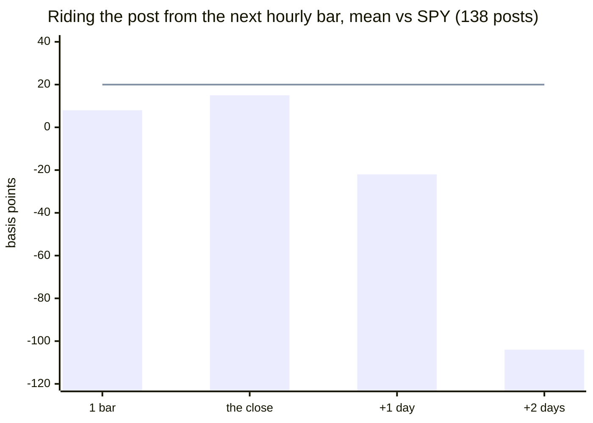

# TACO backtest — what's left of a Trump company post for a reader who sees it late

**Question (Eric's, 2026-10-06, #4820):** _"subscribe to feeds to effectively detect mention of
stocks, calculate the shelf life of the pump and dump, quickly evaluate the trade to make, execute a
trade to lock in a short lived position… closed by EOD, 24-48 hours being general expectations on
the maximum profit. Backtesting the theory presents data that can refine the duration."_

**Verdict: don't trade it.** About ten funds pay Trump Media up to $100k a month for his posts in
milliseconds; a free copy reaches us minutes later. By the next hourly bar, a typical post's move is
small and done. Riding it from there to the close earned **+0.15% on average, a coin-flip 47% of the
time** across 138 posts in his own words. The one hint of an edge, a reversal two days later, falls
apart once Fannie Mae and Freddie Mac are set aside or each post counts once. The big moves are
real but rare: 20 posts in three years, mostly posted while the market was shut.

Reproduce: `node scripts/research/taco-posts.mjs` (add `--events` for one row per event).

_Caption — bars: what a minutes-late rider earned, by exit; line: a 20 bp round-trip cost. Nothing
clears the line, and the day-2 dip is not robust (below). From `scripts/research/taco-posts.mjs`._

## The call

| # | The call | Confidence | Why | Proves it wrong |
|---|---|---|---|---|
| 1 | **Don't** ride a company post after a free feed's delay | high | Next-bar entry to the close: +15 bp mean, −13 bp median, 47% wins, t 0.5 (n 138). Same story at every exit and every entry rule | A re-run on posts after 2026-10-06 shows a ride-to-close mean above 20 bp with t ≥ 2 and n ≥ 40, by 2027-06-30 |
| 2 | **Don't** fade it over two days either — stand aside | medium | +2 days is −104 bp (t −2.0), the literature's reversal in shape, but −69 bp (t −1.3) without Fannie/Freddie and −83 bp (t −1.5) per post; 96 looks need t ≥ 3.5 | The same out-of-sample re-run shows the +2-day fade at t ≥ 2, same sign, n ≥ 40, by 2027-06-30 |
| 3 | The move a post makes is usually small | high | Median jump 11 bp, median size 42 bp; it went the post's way 60% of the time. Only 20 of 138 moved ≥ 2% | A year of new posts where more than a third move ≥ 2% |
| 4 | The big ones are priced before a regular-hours trader can act | medium | 12 of those 20 were posted with the market shut; Fannie Mae and Freddie Mac (2025-05-21, 6:48 pm ET) were up 43% and 61% by the next bar they traded | Open-entry trades on posts made outside hours beat costs in a re-run |
| 5 | A shared headline carries nothing | high | Link shares went the post's way 46% of the time with a −2 bp jump: the news was out before he posted it (Machus et al. 2022 found the same on tweets) | Link shares out of sample move with the post ≥ 60% of the time |

**Signals & conditions**

- **Never** — buy a Trump-named stock at the open after an overnight post; call 4 says it is already priced.
- **Watch** — re-run this script each quarter on posts after 2026-10-06 only; calls 1 and 2 reopen on the falsifiers above, not on an anecdote.
- **Not tested here** — tariff threats against countries and the index rebound after a climb-down (the original "TACO"). That is #4820's next slice.

## What this means for #4820

The plan's own rule fires: no company-post kind beats costs after our delay, so the live path for
company posts (feed, detector, wiring, exits — slices 2 to 5) does not get built, and TACO-DJT
stays dark. The plan stays open for the other family: tariff threats against the index, which
move over days rather than minutes, so a minutes-late reader is not automatically last.

## Sample

| | |
|---|---|
| Corpus | CNN's Truth Social archive: 15,372 original posts with text, 2023-11-07 → 2026-10-06 (reposts dropped) |
| Candidates | 360 (post, ticker) pairs from `scripts/research/taco-companies.mjs`, a hand list of ~120 companies and brands |
| On subject | 250, judged by Claude Haiku 4.5 (356) and by hand (4); 30 spot-checked by eye |
| Events | 216 signed, one per ticker per 24 h; **208 priced** (no bars: DJT before its 2024 listing ×4, US Steel after its 2025 sale ×4) |
| By source | his own words 138 (41 tickers, 121 posts) · shared links 24 · lists of ≥ 4 companies 46 (7 posts) |
| By kind, own words | praise 40 · attack 32 · deal 38 · policy 23 · tariff 5 |
| Timing | 80 of 208 posted while the market was open |

## How the move unfolds

Every number is the stock's return minus SPY's over the same bars, times the direction the post
implies (+ for praise or a deal, − for an attack), in basis points.

**The move we can't catch** — just before the post to the next hourly bar's open:

| group | n | median jump | went the post's way | t |
|---|---|---|---|---|
| praise | 40 | 10 | 55% | 1.4 |
| attack | 32 | 8 | 66% | −0.1 |
| deal | 38 | 18 | 58% | 1.5 |
| policy | 23 | 6 | 57% | 0.6 |
| tariff | 5 | 61 | 100% | 2.1 |
| **all own words** | 138 | 11 | 60% | 1.7 |
| control: shared links | 24 | −2 | 46% | −0.6 |
| control: lists | 46 | 16 | 63% | 2.1 |

**Riding from the next bar** (0–60 min late) — mean · median · win% · t (n):

| group | 1 bar | the close | +1 day | +2 days |
|---|---|---|---|---|
| praise | 23 · 1 · 50% · 0.8 (40) | 31 · −5 · 50% · 0.3 (40) | −20 · 47 · 57% · −0.2 (40) | −138 · −119 · 45% · −1.1 (40) |
| attack | 14 · −2 · 44% · 1.1 (32) | 38 · −2 · 50% · 1.5 (32) | 34 · 7 · 63% · 0.5 (32) | −38 · −31 · 38% · −0.4 (32) |
| deal | 5 · −3 · 47% · 0.1 (38) | 6 · −10 · 47% · 0.1 (38) | 10 · −12 · 49% · 0.2 (37) | −112 · −63 · 44% · −1.3 (36) |
| policy | −12 · 3 · 52% · −0.6 (23) | −75 · −62 · 30% · −2.2 (23) | −161 · −58 · 35% · −1.9 (23) | −204 · −184 · 35% · −3.2 (23) |
| tariff (thin) | −31 · −47 · 20% · −1.2 (5) | 224 · 52 · 80% · 1.6 (5) | 5 · −77 · 40% · 0.1 (5) | 278 · 246 · 80% · 1.4 (5) |
| **all own words** | 8 · −3 · 47% · 0.4 (138) | 15 · −14 · 47% · 0.5 (138) | −22 · 5 · 52% · −0.5 (137) | −104 · −71 · 43% · −2.0 (136) |
| control: shared links | −7 · 2 · 58% · −0.6 (24) | 19 · 6 · 54% · 0.8 (24) | 43 · 0 · 50% · 1.0 (24) | 88 · 93 · 65% · 1.5 (23) |
| control: lists | −2 · −2 · 46% · −0.2 (46) | −46 · −18 · 43% · −2.1 (46) | −68 · −7 · 46% · −1.9 (46) | −115 · −53 · 37% · −2.8 (46) |

Entering a bar later (60–120 min) or only in regular hours changes nothing above (the script prints
both). Fading is the same number with the sign flipped.

**Why the day-2 numbers are not a trade.** The strongest cells are the most clustered. Policy's
t −3.2 is 23 events from about 12 posts, three of them one post naming Ford, GM and Stellantis, and
its direction labels are the least certain (is ending an EV mandate good for GM?). Lists' t −2.8 is
seven posts. For all own words: −104 bp at t −2.0 becomes −69 bp at t −1.3 without Fannie and
Freddie, and −83 bp at t −1.5 counting each post once. With 96 cells printed, a single cell needs
|t| ≥ 3.5 to beat chance.

**Posted while the market was open, or not** — next bar to the close, mean · win · t (n):

| group | market open | market shut |
|---|---|---|
| praise | −60 · 45% · −0.4 (11) | 66 · 52% · 0.6 (29) |
| attack | −25 · 38% · −1.1 (13) | 82 · 58% · 2.2 (19) |
| deal | −22 · 45% · −0.6 (11) | 17 · 48% · 0.3 (27) |
| policy | −17 · 25% · −1.2 (8) | −106 · 33% · −2.1 (15) |
| **all own words** | −29 · 42% · −0.7 (45) | 36 · 49% · 0.9 (93) |

Attacks posted while the market is shut kept going into the close (Intel 2025-08-07 is in this
cell: down 4% vs SPY in the hour after entry, most of it held to the close), but at t 2.2 across 96 looks it is a watch
item, not a call.

**The first hour, on 5-minute bars.** Yahoo keeps 5-minute bars for 60 days, so only 43 recent
events have them, and most were posted outside market hours (their values are flat until the
morning). The few posted during the session show no instant pump: Micron's 2026-08-27 deal post
built from +22 bp at five minutes to +96 bp at an hour; Nvidia's praise the same day was +11 bp at
five minutes and −392 bp by the close. Median across all 43: +9 bp at every point in the first hour.

## The biggest moves, for the record

Signed as everywhere above: + is the post's direction. Times are UTC.

| posted | market | ticker | kind | jump | the close | +2 days |
|---|---|---|---|---|---|---|
| 2025-05-21 22:48 | shut | FMCC | deal (+) | +6,097 | −1,203 | −1,825 |
| 2025-05-21 22:48 | shut | FNMA | deal (+) | +4,342 | +486 | −281 |
| 2026-01-07 21:02 | shut | RTX | policy (−) | −415 | +321 | +60 |
| 2026-04-10 14:32 | open | PLTR | praise (+) | +399 | −44 | +321 |
| 2026-06-18 04:29 | shut | INTC | deal (+) | +393 | +342 | +398 |
| 2025-03-11 04:14 | shut | TSLA | praise (+) | +257 | +485 | +1,027 |
| 2025-08-26 14:39 | open | CBRL | attack (−) | −257 | −65 | −415 |

Even the tail disagrees with itself: Freddie Mac fell 18% from its new price within two days, while
Tesla and Intel kept going. A single hold time would be wrong for half of them. Two rows also show
the labels' limit: the market read the Raytheon threat and the Cracker Barrel "go back to the old
logo" post as good news, the opposite of their labels.

## Method and its limits

- **Corpus.** `https://ix.cnn.io/data/truth-social/truth_archive.json` (36,728 posts; millisecond
  timestamps). Cached under `node_modules/.cache/taco-posts/`; delete it to refresh.
- **Names, not tickers.** He almost never writes a ticker; `taco-companies.mjs` maps names and brands
  (Tylenol → KVUE, Coke → KO). News organisations are left out: named near-daily as media criticism,
  a different question. "DJT" is left out because it is also his signature, so the 2025-04-09
  "GREAT TIME TO BUY!!! DJT" post is not in the sample.
- **Labels.** `docs/research/taco-posts-labels.json` holds every (post, ticker) judgement with its
  reason and who made it; no post text is committed. A cheap model is right for a first pass and
  wrong for the last word: the policy kind's directions are the weakest labels here.
- **Prices.** Yahoo 60-minute bars with pre- and post-market, back to 2023-11. Hourly bars cannot
  separate entries 0, 5 and 15 minutes after a post; the "before" price is the open of the bar the
  post landed in, up to 59 minutes early.
- **Benchmark.** SPY over the same bars; no beta adjustment.
- **Costs.** Not subtracted in the tables; the picture's 20 bp round trip is a liquid large-cap,
  regular-hours figure. Pre-market spreads are wider, which only strengthens calls 1 and 4.
- **Today's tickers.** Delisted names (US Steel) drop out; no survivorship correction.

Offline research tooling only: no broker credential, no trading path, nothing placed.
