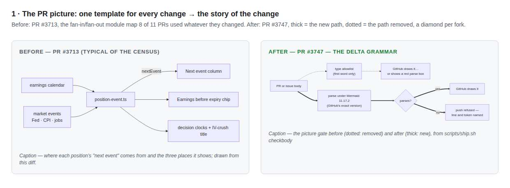
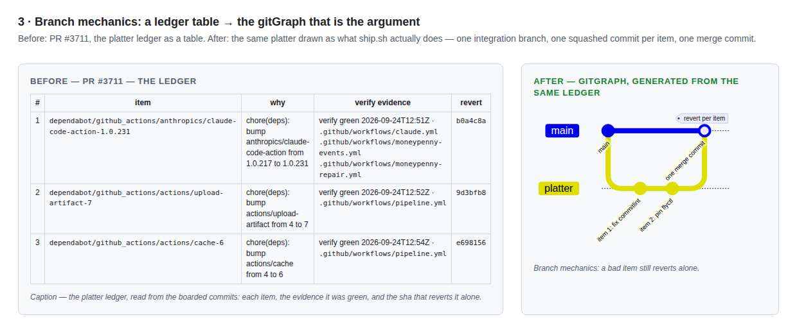
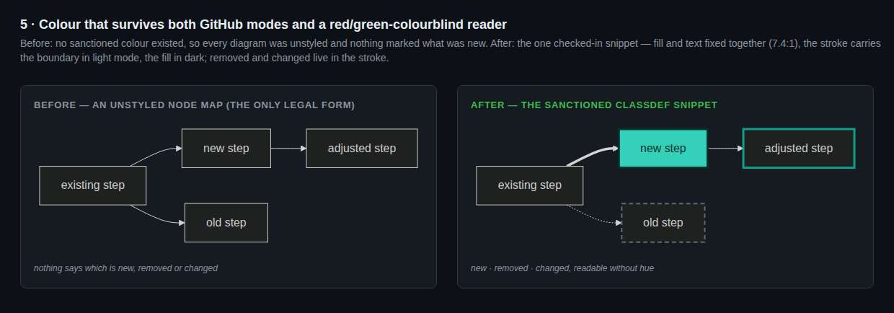

# The Mermaid program — before and after, by eye

Five pairs, each rendered with the exact Mermaid version github.com runs (11.17.2) in GitHub's
light and dark modes. The left panel of each is a real picture from the 40-PR census of
2026-09-25; the right is the same story told with the grammar that landed in #3748's slices
(`docs/PICTURES.md`, `/mermaid`, `docs/architecture/`). Provenance: the renderer is the pinned
Mermaid in the repo's own Chromium; the pair definitions and the renderer live with the session's
scratchpad and are reproducible from the sources named in each caption.

| Pair | The change | Light | Dark |
|---|---|---|---|
| 1 | The PR picture: one template for every change → the story of the change (thick = new, dotted = removed) | [1-pr-picture-light](1-pr-picture-light.jpg) | [dark](1-pr-picture-dark.jpg) |
| 2 | A lifecycle: a flowchart → the state machine it is (composite state, guarded transitions) | [2-lifecycle-light](2-lifecycle-light.jpg) | [dark](2-lifecycle-dark.jpg) |
| 3 | Branch mechanics: the platter ledger table → the gitGraph that is the argument | [3-platter-light](3-platter-light.jpg) | [dark](3-platter-dark.jpg) |
| 4 | Architecture: a 4,000-node text report → a C4 storybook, one page per container | [4-architecture-light](4-architecture-light.jpg) | [dark](4-architecture-dark.jpg) |
| 5 | Colour that survives both GitHub modes and a red/green-colourblind reader | [5-colour-light](5-colour-light.jpg) | [dark](5-colour-dark.jpg) |

