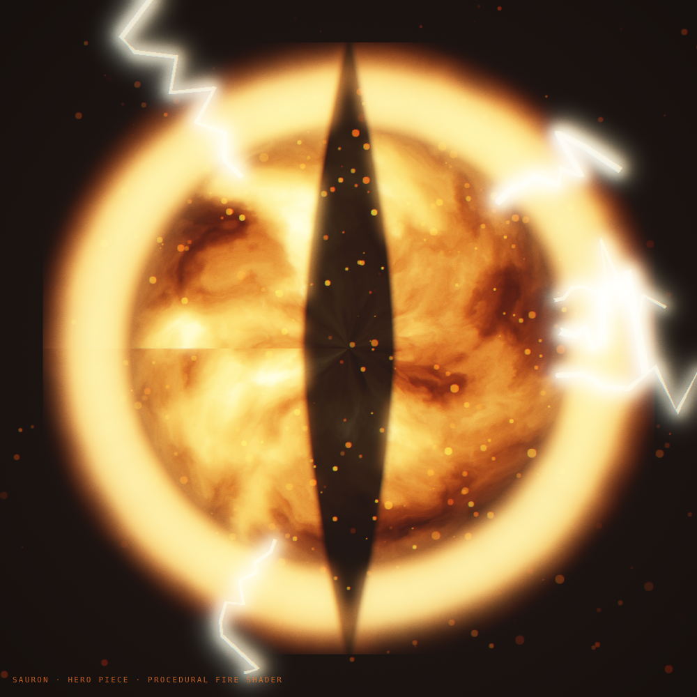

# Spike — The Eye of Sauron as a Babylon hero piece

**Question (Eric):** what is Claude capable of with Babylon.js, for **first-class player/hero models**
with high-def detail and flare?
**Answer: this.** A procedural, shader-driven Eye — turbulent fire iris, slit pupil, blazing rim,
ember corona, and jagged electric arcs — rendered live in WebGL.



## What's under the hood

- **A custom GLSL fire shader** (not a texture): domain-warped FBM plasma flowing outward + swirling,
  ramped deep-red → gold → white-hot, with a bright iris ring and a vertical almond **slit pupil** cut
  from the flame. This is the "high-def" part — it's procedural, so it's infinitely crisp and animated.
- **Electric arc corona** — jagged least-path bolts spawned around the rim each frame (the "flare").
- **Ember/spark particles** radiating off the iris.
- **Cinematic post-fx** — glow + bloom + tonemap + vignette + film grain + chromatic aberration.

~140 lines, one file. It renders headless (see `preview.png`).

## Why this matters for the architecture — the piece system

This is **hero piece #1**, and it demonstrates the split Eric described for the 3D component library:

- **Lego pieces** — parametric, reusable, low-flair building blocks: `tower()`, `building()`, `beam()`,
  `scanner()`, `ember()`, `bolt()`. Pure functions of params → a Babylon subtree. (The tower spike is
  a composition of these.)
- **Hero pieces** — unique, **high-def, extra-flair** first-class models: the **Eye**, player avatars,
  persona landmarks, boss structures. Richer shaders/particles, more art budget, often bespoke — but
  they still obey the same contract and compose *from* lego pieces where it helps.

**The shared contract** every piece implements (the thing that stops custom-code-makes-custom-code,
audit S1):

```
createPiece(scene, opts) -> {
  node,                 // a Babylon TransformNode you place/parent
  update(t, dt),        // per-frame animation (or noop)
  dispose(),            // clean teardown
  reducedMotion(),      // a static, loop-free presentation
}
```

Pieces live in `src/scene/` — `src/scene/lego/*` and `src/scene/heroes/*` — each **small** (the
`arch-budget` gate keeps them honest), each independently testable, composed into scenes by a catalog
(the same pattern as the persona registry). The Eye is `src/scene/heroes/eye.ts`.

## Where this goes

Eric's read is right: this is faster to develop *and* better-looking than hand-rolled 2D canvas, and it
scales — which is why the **intro screen becomes a strong port target**. The path (per the tower spike
README): tree-shaken `@babylonjs/core` bundle, lazy-load behind the login with the 2D layer as the
no-WebGL / reduced-motion fallback, and build it out of the piece system above — starting with the two
heroes we've now proven (the Eye + the tower) and the lego pieces they share.
