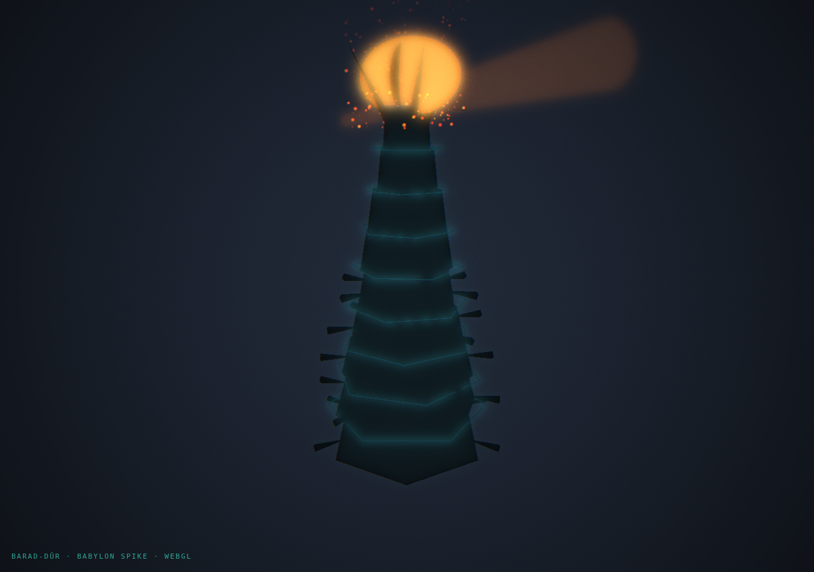

# Spike — Barad-dûr in Babylon.js

**Question:** should the login's hand-rolled 2D-canvas Sauron tower become a real 3D scene?
**Answer from this spike: yes — it's dramatically cooler *and* it's a decomposition win.**



## What this is

A self-contained Babylon.js scene (`index.html`) of Barad-dûr: a dark, tapering, twisted tiered
fortress with electric-teal tracer edges (Fresnel rim so faces stay black, silhouettes catch light),
buttress spikes, crown horns cradling a **blazing fiery Eye** (fresnel-hot almond + slit pupil),
rising embers (particle system), electric bolts crawling the tower (fractal tubes), a searching gaze
beam, and a cinematic slow orbit — all under bloom + grain + vignette + chromatic-aberration post-fx.

It's ~250 lines of readable scene code. Compare the current tower: hundreds of lines of imperative
2D-canvas draw calls buried inside the 2,893-line `authenticator.ts` god-file (see the engineering
audit, finding C1).

## Run it

```sh
open spikes/babylon-tower/index.html          # loads Babylon from the official CDN
```
(Needs network for the CDN `<script>`. To render offline — e.g. in CI/screenshots — drop a local
`babylon.js` next to the file and point the `<script src>` at it.)

## Why this beats the 2D tower

- **Real depth & light.** Parallax, self-shadowing silhouettes, a light that actually emanates from
  the Eye — impossible to fake convincingly in 2D. The orbit alone sells it.
- **Composable, not custom.** Tower / Eye / embers / bolts / post-fx are independent objects in a scene
  graph, tuned by parameters — the opposite of bespoke `ctx.lineTo` sequences. This is the
  "component system, not custom-code-that-makes-custom-code" fix (audit S1) applied to the hero art.
- **Decomposition.** A real integration extracts the scene into typed modules (`tower.ts`, `eye.ts`,
  `effects.ts`, `scene.ts`) — pulling the single biggest chunk of art *out* of the god-file (audit C1).
- **Headroom.** Once the engine's in, the whole north-star gameplay layer (the sim-city empire, the
  living universe) has a real 3D home — the babylon.js idea already parked in `docs/IDEAS.md`.

## Integration path & tradeoffs (if we green-light it)

1. **Bundle, don't CDN.** Use `@babylonjs/core` tree-shaken (esbuild) — a scene this size bundles to
   ~1–1.5 MB, self-hosted (no external fetch; keeps the CSP-safe posture). The full UMD build (8 MB)
   is spike-only.
2. **Progressive enhancement.** Lazy-load the 3D layer *after* the login is interactive; keep the
   existing 2D tower as the fallback for no-WebGL and `prefers-reduced-motion` (render one static
   frame, no loop) — nobody gets a blank hero.
3. **Decompose on the way in.** Land it as `src/login/scene/*.ts` modules with a build step, which
   also starts breaking up `authenticator.ts`.
4. **Perf budget.** Cap DPR, pause the render loop when the tab's hidden / the form's open, one static
   frame under reduced-motion — same discipline as the current canvas layers.

**Recommendation:** promising enough to pursue as a real feature, but it's a build-pipeline change
(bundler + a dependency + decomposition), so it's a deliberate project, not a drop-in. Gate on Eric's
go; if yes, it slots neatly against audit findings C1/S1 and the Living-Universe 3D direction.
