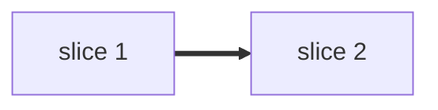
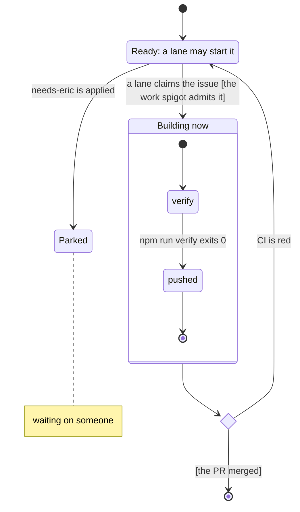

**A fixture plan issue: its picture is a flowchart, its lifecycle a state block (#3748 slice 9).**

```mermaid
flowchart LR
  a["slice 1"] ==> b["slice 2"]
```

## State block — read this first, then pick up

```mermaid
stateDiagram-v2
  direction TB
  state "Ready: a lane may start it" as Ready
  state "Building now" as Building
  state Building {
    [*] --> verify
    verify --> pushed: npm run verify exits 0
    pushed --> [*]
  }
  state landed <<choice>>
  [*] --> Ready
  Ready --> Building: a lane claims the issue [the work spigot admits it]
  Building --> landed
  landed --> Ready: CI is red
  landed --> [*]: [the PR merged]
  Ready --> Parked: needs-eric is applied
  note right of Parked: waiting on someone
```

**Next pickup: the fixture's own build.**
